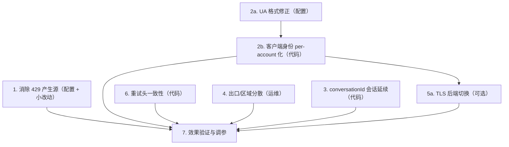

# 号池封禁治理与客户端指纹对齐 — 实施计划

## 执行进度（2026-08-31）

| 任务 | 状态 | 备注 |
|---|---|---|
| T2a UA 缺省值修正 | ✅ 已完成 | `default_system_version` → `win32#10.0.26200`；`default_kiro_version` → `1.0.395`；仓库两份 `config.json` 模板同步 |
| T2b 客户端身份 per-account 化 | ✅ 已完成 | 新增 `src/kiro/client_identity.rs`；凭据新增 `systemVersion` / `nodeVersion`；11 处 UA 全部改为按号解析 |
| **C9 envState 一致性**（新发现） | ✅ 已完成 | 计划初版遗漏。详见下方「C9」 |
| T6 重试头对齐 | ✅ 已完成 | `amz_sdk_request_header` 与 `x-kiro-attempt` 同源 |
| T1 代码部分（429 短冷却） | ✅ 已完成 | 新增 `failoverRateLimitCooldownMs`，**缺省 0 = 保持历史行为** |
| T1 配置部分（`rpmLimit`） | ⏸ 待执行 | 生产面板操作，见任务 1 |
| T4 出口 / 区域分散 | ⏸ 待执行 | 运维操作 |
| T3 conversationId 会话延续 | ⏸ 未开始 | 下一批 |
| T5 TLS 后端切换 | ⏸ 待拍板 | 可选 |
| 原 T5b HTTP/2 | ❌ 不做 | 见文末 |

验证：`cargo clippy --all-targets` 无新增告警，`cargo test` **1722 passed / 0 failed**。

### C9：请求体 `envState` 与 UA 自相矛盾（计划初版遗漏）

`EnvState::default()`（`src/kiro/model/requests/conversation.rs`）此前：

- `operatingSystem` 写死 `"macos"`
- `currentWorkingDirectory` 取 `std::env::current_dir()`，即**容器的工作目录**，
  全池完全相同——既暴露部署形态，又是一个免费的跨号关联键

这让 T2a 变成一个**必须同批处理**的问题：把 UA 改成 `os/win32#...` 之后，
UA 说 win32 而请求体说 macos，是我们自己造出来的新矛盾，比原来更显眼。

改法：`envState` 不再由转换阶段决定（那时还没选号，拿不到凭据），改为在端点层
按凭据改写。`operatingSystem` 与 `currentWorkingDirectory` 都从同一个
`system_version` 派生，因此不可能被配置成互相矛盾的组合。

## 背景

2026-08-31 12:19–12:27 的 8 分钟内，20 个 runtime 号被上游逐个判死，文案统一为
`TEMPORARILY_SUSPENDED` / "unusual user activity"，出口分散在约 18 个不同 IP，
`ever_direct=false`。号池归零。此前 08-30 12:43 也有一波 5 个。

对照事实：合作方单号自然使用，长期零封禁。

### 已测数据（2026-08-31，生产 traces.db + credentials.json + proxy_ban_stats.json）

| 观测项 | 实测值 | 备注 |
|---|---|---|
| 单号成功请求 | 750–826 次/小时，持续 19 小时 | — |
| 单号实际 RPM | ~13.8（即上游天花板），`rpmLimit` 却设为 30 | 我们按天花板 2 倍投递 |
| 单号 429 占比 | 8.3% – 11.6% | — |
| **出现「0 个 429」的分钟** | **181 个采样分钟中 0 个** | 429 流从未中断 |
| 普通 429 后的账号冷却 | **无**（`retryMode: failover` 跳过 `report_rate_limited`） | 见任务 1 |
| 死前累计成功 | 639 – 6063 次 | — |
| 存活时长 | 5.8h / 15.6h / 18.9h / 22.4h（四批混杀） | 同一分钟被收，非各自到期 |
| `machineId` | 11 个号 11 个唯一值 | 已是唯一 |

**两个已被排除的假设：**

1. **`machineId` 不是问题**——已是一号一个唯一值。
2. **单号总请求量不是主因**——合作方单号请求量数倍于我们仍长期零封禁。

**当前最可能的直接触发：持续产生 429 且账号级从不退避。**
我们按天花板 2 倍的速率投递，超出部分吃 429 后立刻同端点重试（99.2% 成功），
该号也不进冷却，于是 429 流一分钟都没断过、连续 19 小时。对上游而言这是
「已知超限仍持续超限投递」的形态，而不是「用得多」。

**导致「整批一起死」的是下列跨号共用特征**，它们让上游从一个被标记账号
低成本枚举出整个池子。

### 跨号共用特征清单（聚类键）

| # | 特征 | 现状 | 官方 IDE 实际 |
|---|---|---|---|
| C1 | UA 中 OS 段 | `os/macos`（**格式非法**） | `os/win32#10.0.26200` / `os/darwin#24.5.0` |
| C2 | UA 中 Node 段 | 全池 `nodejs#22.22.0` | 随安装环境不同 |
| C3 | TLS 栈 | `rustls`（全池同一 JA3/JA4） | Node/Electron OpenSSL |
| C4 | HTTP 版本 | 强制 HTTP/1.1 + `Connection: close`，一请求一连接 | HTTP/2 + keep-alive（**已决定不改，见文末**） |
| C5 | 出口网段 | 8 个启用号集中在 `154.91.153.x` / `154.91.155.x` / `154.91.156.x`（同供应商三个相邻 /24） | 分散 |
| C6 | API 区域 | 11 个号中 9 个钉 `us-east-1` | 随地理分布 |
| C7 | 会话形态 | Anthropic 路径每请求一个全新 `conversationId`，却携带完整历史 | 一个会话连续多轮 |
| C8 | 重试头一致性 | `amz-sdk-request: attempt=1; max=3` 写死，`x-kiro-attempt` 动态 → 同一次重试两头矛盾（**已修**） | 两者同步递增 |
| C9 | 请求体 `envState` | `operatingSystem` 写死 `macos`；`currentWorkingDirectory` 是容器 cwd，全池相同（**已修**） | 与 UA 同一台机器；用户真实项目目录 |

`kiroVersion` 已由 autofetch 取到真实 `1.0.395`（`config.json` 中的 `2.3.0` 仅为 fallback，
当前未生效），不在问题清单内，但 fallback 值本身需要修正。

---

## 任务依赖与波次



| 波次 | 内容 | 代码改动 | 生效方式 | 状态 |
|---|---|---|---|---|
| Wave 1（立即） | T2a、T4 黑名单 | 无 | config.json + 重启 | 待执行 |
| Wave 1.5 | T1（`rpmLimit` 收到天花板 + 429 短冷却） | 冷却部分需小改动 | 面板 + 发版 | **待定，见任务 1** |
| Wave 2 | T2b、T6 | 有 | 测试站验证后发版 | 待执行 |
| Wave 3 | T3 | 有 | 测试站验证后发版 | 待执行 |
| Wave 4（可选） | T5a | 有 | 仅测试站验证后 | 待拍板 |

**HTTP/2（原 T5b）已决定不做**，理由见文末「明确不做的事」。

Wave 1 不依赖任何代码改动，可立即执行。Wave 2–4 降低跨号相关性，
属于「别让一个死号带走整批」。

---

## 任务 1：消除 429 产生源

> **修订记录（2026-08-31）**：本任务初版是「把单号强度砍到 60–120 次/小时」，
> 依据是「单号量级差 60–360 倍」。该依据已被推翻：合作方单号请求量数倍于我们
> 且长期零封禁，说明**总量不是触发条件**。同时实测证明「429 沿降级链连打多个桶」
> 也不成立（`same-endpoint` 模式不换桶）。
>
> 本版目标改为：**在不牺牲吞吐的前提下，让 429 从「持续产生」变成「偶发」。**
> 不再砍量。

**优先级：高，但需先拍板第 2 项（429 冷却）要不要做。**

### 目标

- 单号 429 占比从 8.3%–11.6% 降到 1% 以下
- 「0 个 429」的分钟占比从 0% 提到 50% 以上
- 单号吞吐**不下降**（保持 ≥ 700 次成功/小时）

### 现状

- `KiroCredentials::rpm_limit` / `max_concurrency` 已是 per-account 字段
  （`src/kiro/model/credentials.rs`），缺省 `rpm_limit = 10`
  （`src/admin/types.rs:322` `default_rpm_limit`），**线上被设为 30 / 并发 3**。
- 限流语义是**选择时跳过**，不是排队：
  - `is_rpm_exceeded`（`src/kiro/token_manager.rs:1649`）
  - `is_concurrency_exceeded`（`src/kiro/token_manager.rs:1659`）
  - 全部号都被跳过时 `bail!("所有凭据均已禁用")`（`token_manager.rs:2455`），
    对客户端表现为 503。
- `rpm_infer`（`src/admin/rpm_infer.rs`）已经在按分钟推算每号天花板，面板可见，
  但**不会**自动改 `rpmLimit`。

#### 重试形状实测（3 小时窗口，18791 条 trace）

先前假设「429 会沿降级链连打多个低成功率桶」**经实测不成立**，已作废。
线上 `rateLimitBucketMode: same-endpoint`（config.json 未配该键，走枚举默认值
`RateLimitBucketMode::SameEndpoint`，`src/model/config.rs:69`），
`apply_bucket_mode` 在该模式下返回**空链**（`src/kiro/endpoint/rate_limit.rs:23`），
因此普通 429 从不换桶。`endpointChains: {"ide": [...]}` 在主端点为 `runtime`
时属于死配置，但也无影响。

| 观测项 | 实测值 |
|---|---|
| 单跳完成 | 87.9% |
| 两跳 | 11.3% |
| ≥3 跳 | 0.4% |
| 含 429 的 trace | 2052 条（10.9%） |
| 其中在**紧接的同端点重试**里成功 | 2035 条（**99.2%**） |
| 主序列 | `runtime:429 > runtime:200`，2018 条 |

#### 真正的问题：持续产生 429，且从不退避

1. **单号天花板约 14/分钟，我们允许 30/分钟。**
   实测单号 826 次成功/小时 ≈ 13.8/分钟，这就是上游给该号的实际上限。
   `rpmLimit = 30` 意味着我们持续按超过天花板一倍的速率投递，超出部分必然吃 429。
2. **`retryMode: failover` 下普通 429 完全不冷却。**
   两处 `report_rate_limited` 都被 `if retry_mode != RetryMode::Failover` 挡住
   （`src/kiro/provider.rs:1515`、`:2227`）。429 之后该号 `rate_limited_until`
   不被设置，立刻仍可被选中。同端点重试本身有退避
   （`retry_delay_throttle`，1s 基数、上限 8s，`provider.rs:2540`），
   但**账号级没有任何退避**。
3. **后果：429 流永不中断。** 181 个采样分钟里**没有一分钟是 0 个 429**，
   平均 11.4/分钟，单号约 90 次/小时，已连续 19 小时。
   每号 429 占比 8.3%–11.6%。

对上游而言这是「明确知道自己超限、仍持续按超限速率投递」的客户端形态，
且 8 个号同时呈现同一形态。合作方单号请求量更大却零封禁，与此一致——
自然使用不会产生持续的限流违规流。

> 归因说明：无法证明上游判死规则。但「持续 429 + 跨号同形」比「单号总量」
> 更能解释「量更小的号先死、量更大的单号不死」，且成本更低、可先验证。

### 改法：消除 429 产生源，而不是砍吞吐

**核心：把超出天花板的那部分请求在本地就换到别的号，而不是发出去被上游拒绝。**

1. **`rpmLimit` 由 30 降到实测天花板附近（起步 14）**，逐号取
   `rpm_infer` 的推算值。这一步**不会**等比砍吞吐：
   - 当前池级吞吐约 104 次成功/分钟（8 号 × 13.8）
   - 8 号 × `rpmLimit 14` = 112/分钟容量
   - 被限流跳过的请求转投其它号，而不是被拒绝后重试
   余量只有约 8%，偏紧。**建议 14–16 起步，或补 1–2 个号留头寸**。
2. **让普通 429 也进短冷却** —— ✅ **代码已完成**，等待开启。
   新增配置项 `failoverRateLimitCooldownMs`（`Config`，`serde(default)`）：
   - **缺省 `0` = 完全保持历史行为**（failover 不冷却），因此可随时关掉回滚
   - 设为 `2000`–`5000` 后，普通 429 会给该号加一段短冷却；换号逻辑完全不变
   - 上游给了 `Retry-After` 就照办，但以配置值为下限（防 `Retry-After: 0`
     等于没冷却）、120s 为上限（防上游一个大数把号长时间移出轮转）
   - 实现：`provider.rs` 的 `failover_rate_limit_cooldown()`（纯函数，有单测）
     + `apply_ordinary_429_cooldown()`，替换原先两处 `if retry_mode != Failover`
   - 未选「改 `retryMode`」方案：`failover` 与其它模式在「换不换号、松不松粘滞」
     上语义不同（`provider.rs:2211`），改模式会一次改动多处行为
3. `maxConcurrency` 由 3 降到 2。RPM 限速率、并发限瞬时，两者互补。
4. `maxBucketAttemptsPerRequest: 6` 与 `sameEndpointAttempts: 3` 当前实际只用到
   1–2 跳（≥3 跳仅 0.4%），**保持不变**，不要为了「看起来更收敛」去动它——
   99.2% 的 429 靠这一次同端点重试救回来了，砍掉会直接把 429 透传给客户端。
5. 客户端侧用 `maxCredits`（`src/admin/client_keys.rs:246`）给高消耗 Key 设上限。
   当前 key_id 7 占约一半流量。

### 验收

- **单号 429 占比 ≤ 1%**（当前 8.3%–11.6%）
- **出现「0 个 429」的分钟数 > 50%**（当前 0%）—— 这是最关键的一条：
  从「持续违规」变成「偶发触顶」
- 单号 `ok/h` 不显著下降（目标：≥ 700，即不牺牲吞吐）
- 503 / `no_available_credentials` 无明显上升
- 24 小时内无 `疑似上游批量清扫` 日志（`src/admin/proxy_ban_stats.rs:382`）

### 可能引入的 bug 与修复方案

| # | 症状 | 根因 | 修复方案 |
|---|---|---|---|
| 1.1 | 503 / `所有凭据均已禁用` 暴增 | 限流是「选择时跳过」不是排队（`token_manager.rs:1649`）。8 号 × 14 = 112/分钟容量 vs 当前 104/分钟需求，余量仅 8%，峰值必然打穿 | **上线顺序**：先把 `rpmLimit` 设 16（而非 14）留头寸，观察 429 是否已降；不够再补号后收到 14。**中期**（代码）：`select` 全部命中限流时改为短暂等待（≤2s）后重选，而不是立刻 `bail`；需在 `token_manager.rs:2455` 把「全禁用」与「全限流中」区分开，后者可等 |
| 1.2 | 429 降了但吞吐也掉了 | `rpmLimit` 收得低于真实天花板 | 用 `rpm_infer` 的 `kind` 判断：`Ceiling` 表示已触顶不要再加，`Floor` 表示还能往上试。逐号微调而不是全池一个值 |
| 1.3 | 加了 429 冷却后，长尾请求延迟上升 | 冷却期内该号不可选，请求要绕到别的号 | 冷却设 2–5s 而非分钟级；优先用上游 `Retry-After`（`provider.rs:2480` 已能解析） |
| 1.4 | 改 `retryMode` 引发连带行为变化 | `failover` 与其它模式在「换不换号、松不松粘滞」上语义不同（`provider.rs:2211`），改模式会一次改动多处行为 | 优先选代码侧方案（只加冷却，不改模式），把变更面收窄到一处 |
| 1.5 | `maxConcurrency=2` 后长流占位 | 一条 10 分钟的流占该号一个并发位 | 保持 2，不要降到 1；必要时按模型分组隔离长 opus 与短请求 |
| 1.6 | 加冷却后 `rpm_infer` 推算值失真 | 推算依赖「见过 429 的分钟」，429 变少后样本减少 | 预期行为。推算从 `Ceiling` 转为 `Floor` 即说明已脱离触顶状态，这正是目标 |

---

## 任务 2：客户端身份修正与 per-account 化

### 2a. UA 格式修正（配置，立即可做）

**现状**：`config.json` 中 `systemVersion: "macos"`。该值被拼进 UA 的 `os/` 段
（`src/kiro/endpoint/runtime.rs:63-70`）。真实 Kiro IDE 从不发送 `os/macos`——
正确形态是 `os/win32#10.0.26200` 或 `os/darwin#24.5.0`。这是全池唯一且非法的静态标记。

`default_system_version()` 返回 `"macos"`（`src/model/config.rs:1326`），
而 `runtime.rs` 的测试用的是 `win32#10.0.26200`（`runtime.rs:230`）——
说明抓包基线是对的，是缺省值写错了。

**改法**：

1. `config.json`：`systemVersion` → `win32#10.0.26200`
2. `config.json`：`kiroVersion` → `1.0.395`（修正 fallback，autofetch 失效时不再暴露假版本 `2.3.0`）
3. 代码：`default_system_version()` 同步改为 `win32#10.0.26200`，避免新部署再踩

**验收**：容器日志中 UA 的 `os/` 段为合法形态；`x-amz-user-agent` 与
`user-agent` 中的 `KiroIDE-1.0.395-<machineId>-KAS/0.54.0` 一致。

### 2b. 客户端身份 per-account 化（代码）— ✅ 已完成

**落地实现与计划的差异（择优调整）**：

1. **不改导入流程，改为「首次加载时回填并落盘」**。
   复用 `machine_id` 已验证过的套路（`MultiTokenManager::new` 里的补全逻辑）：
   `client_identity::assign_missing()` 在加载时按号分配并触发持久化。
   好处是存量号立刻拿到分配、不必改导入接口、值写进 JSON 可见可改，
   而且彻底避开了「凭据级 > 全局 config」的优先级歧义
   （若靠运行时派生，全局配了值就会盖住 per-account 变化）。
2. **种子用 `machine_id` 而非 `refreshToken`**。
   `refreshToken` 会在每次刷新时轮换，拿它派生等于让号定期换一套环境——
   正好是本任务要避免的「号在多台机器间跳」。`machine_id` 首次加载即落盘、之后不变。
3. **`kiroVersion` 保持全局**，不做 per-account。它由 autofetch 取真实版本，
   人为打散反而会发出官方已下线的旧版本号。
4. 新增 `client_identity::PROFILES` 白名单（5 组真实 OS/Node 搭配），
   **成组取用**，不允许两列分开随机。

**目标**：OS / Node 版本变成 per-account，**导入时从真实组合白名单里挑一套并钉死**，
之后永不变化。

> 明确不做**每请求随机**。同一个号今天 win32、明天 darwin，比全池固定 `macos` 更可疑。
> 指纹的价值在于稳定且自洽，不在于熵。

**改动点**：

1. `src/kiro/model/credentials.rs`（`machine_id` 附近，约 145 行）新增两个字段：
   ```rust
   #[serde(default, skip_serializing_if = "Option::is_none")]
   pub system_version: Option<String>,
   #[serde(default, skip_serializing_if = "Option::is_none")]
   pub node_version: Option<String>,
   ```
2. 新增身份解析 helper（建议放 `src/kiro/machine_id.rs` 旁，或新建
   `src/kiro/client_identity.rs`）：优先凭据级 → 其次 `config` → 最后缺省，
   与 `machine_id::generate_from_credentials` 的优先级语义保持一致。
3. **所有拼 UA 的位置统一改为调用该 helper**。清单（漏一处就会出现同号不同接口
   UA 不一致，比全池一致更可疑）：
   - `src/kiro/endpoint/runtime.rs:63`
   - `src/kiro/endpoint/runtime_cli.rs:47`
   - `src/kiro/endpoint/ide.rs:36,46`
   - `src/kiro/endpoint/codewhisperer.rs:44,54`
   - `src/kiro/endpoint/amazonq.rs:43,53`
   - `src/kiro/endpoint/cli.rs:40`
   - `src/kiro/token_manager.rs:667,860,924,1009`（用量 / 模型 / API Key 类 REST）
4. 白名单组合（真实搭配，不要交叉拼）：
   | OS | Node |
   |---|---|
   | `win32#10.0.26200` | `22.22.0` |
   | `win32#10.0.22631` | `20.18.1` |
   | `darwin#24.5.0` | `22.22.0` |
   | `darwin#23.6.0` | `20.18.1` |
   | `linux#6.8.0` | `22.22.0` |
5. 导入流程（`src/admin/handlers.rs:328` 批量导入）在写入凭据时按号轮转分配一套。

**验收** — ✅ 已通过：

- `every_endpoint_declares_the_same_environment`（`endpoint/mod.rs`）：
  遍历 6 个端点构造真实请求，断言 UA 的 `os/` 与 `md/nodejs#` 都取凭据级值。
  测试刻意把全局 config 设成 `linux#0.0.0` / `0.0.0`——**任何一处漏改都会红**。
- `every_endpoint_rewrites_env_state_to_match_the_ua`：断言 `currentMessage` 与
  `history` 两处 `envState` 都被改写、且与 UA 同源。
- `client_identity` 模块 14 项单测：分配稳定性、跨号分散度、
  半填充时整组重取、不泄露进程 cwd、两个用途的哈希下标不相关。
- `ua_defaults_are_plausible_client_values`（`config.rs`）：回归守卫，
  锁住 `os/macos` 与 `kiroVersion 2.3.0` 不会再出现。
- 旧 JSON 兼容：新字段是 `#[serde(default, skip_serializing_if = "Option::is_none")]`，
  现有 1722 项测试（含大量凭据反序列化用例）全部通过。

### 可能引入的 bug 与修复方案

| # | 症状 | 根因 | 修复方案 |
|---|---|---|---|
| 2.1 | 启动即失败，全池凭据加载不出来 | 新字段没加 `serde(default)`，老 JSON 缺字段导致反序列化报错 | 必须 `#[serde(default, skip_serializing_if = "Option::is_none")]`。加旧 JSON 兼容回归测试，参照 `credentials.rs:1490` 一带的既有测试 |
| 2.2 | 同一个号聊天走 win32、查余额走 macos | 只改了 endpoint 没改 `token_manager` 的 4 处 REST | 用 helper 统一，并加「所有路径 UA 一致」的断言测试锁住 |
| 2.3 | OS 与 Node 组合不自然（如 `win32` + macOS 常见 Node 版本） | 随机交叉拼装 | 只按白名单整组取用，不单独随机某一段 |
| 2.4 | 导入时未分配，新号回落全局值 | 导入路径漏接 | helper 保证有回落，不会崩；但要在导入后校验分配率，避免新号全挤同一套 |
| 2.5 | 改了 UA 后 429 或 403 上升 | 上游对某些 OS 段有差异化策略（未证实） | 先在测试站用 1–2 个号跑 30 分钟对比首包与 429 率，再全量 |

---

## 任务 3：conversationId 会话延续

### 目标

消除 C7：让上游看到「一个会话连续多轮」，而不是「每小时 800 个全新会话，每个都带完整历史」。

### 现状

- `src/anthropic/converter.rs:874-881`：Anthropic 路径每次 `Uuid::new_v4()`。
  代码注释写明了原因——复用 `metadata.user_id` 会让并发请求在上游争用同一会话状态。
  **这个顾虑是真实的，改动必须处理并发。**
- OpenAI/Codex 路径已支持复用：`conversation_id_hint`（`src/anthropic/types.rs:141`），
  由 `resolve_openai_conversation_id`（`src/openai/types.rs:269`）从
  `prompt_cache_key` / `x-session-affinity` / `x-client-request-id` / `session_id` 解析。
- 已有可用的会话标识：`session_hash`
  （`src/anthropic/compaction_diagnostics.rs:156`，落库到 `traces.session_hash`，
  `src/admin/trace_db.rs:1278` 并有索引）。最近 2 小时 12742 条 trace 对应 127 个
  distinct `session_hash`——说明客户端确实有会话结构，只是没传导到上游。

### 改法

1. 新增进程内映射 `session_hash -> (conversation_id, last_used, in_flight)`，
   TTL 30–60 分钟，LRU 上限（如 10k）。
2. `converter.rs` 生成 `conversation_id` 时：
   - 已有 `conversation_id_hint`（OpenAI 路径）→ 保持现状，优先级最高
   - 否则有 `session_hash` 且映射项**不在飞** → 复用
   - 否则 → 新建 UUID（保持今天的行为）
3. `agent_continuation_id` 继续每轮新建——官方也是每轮新的，不要一起复用。
4. 映射 key 除 `session_hash` 外，再拼入 system prompt 指纹：同一客户端换了
   system prompt 应当视为新会话。

### 验收

- 同一客户端会话的连续多轮请求，上游 `conversationId` 相同
- 并发压测（同一 session 同时 5 条）不出现 400 / 内容错乱
- `traces` 中 distinct `conversationId` 数量显著下降，接近 distinct `session_hash`

### 可能引入的 bug 与修复方案

| # | 症状 | 根因 | 修复方案 |
|---|---|---|---|
| 3.1 | 同一会话并发请求返回内容错乱、或上游 400 | 两条请求带着不同长度的历史争用同一 `conversationId`，正是原注释担心的情况 | 映射项带 `in_flight` 标记，占用中的请求退回新 UUID；或按 `(session_hash, 历史消息数)` 分桶，只有历史严格递增的后继轮才复用 |
| 3.2 | 会话延续没生效，`conversationId` 仍然每次新建 | `session_hash` 依赖 compaction 诊断链路，该功能可能未启用（`provider.auto_compact_diagnostics_enabled()`，`src/anthropic/handlers.rs:280`）导致值为 `None` | 会话标识的计算不能挂在诊断开关下。若耦合，则把 hash 计算提取为独立函数，与诊断开关解耦；并加测试断言诊断关闭时仍有 session 标识 |
| 3.3 | 号池收益 / 利润报表的 credits 明显下降，被误判为「计量丢了」 | 上游缓存命中率上升，同样的对话消耗的 credits 真的变少了 | 这是收益，不是 bug。改动上线时在 CHANGELOG 记录时间点，避免后续排查误判。同时提醒：卖价（¥/credit）会随之漂移，需要重跑一次 NewAPI 利润报表 |
| 3.4 | 长会话复用同一 `conversationId` 后触发上游上下文超限 | 上游按 conversation 累积状态 | 映射项加轮数 / 累计 token 上限，超过即轮换新 `conversationId` |
| 3.5 | 内存增长 | 映射无上限 | LRU + TTL，并在 admin 接口暴露当前条目数便于观测 |

---

## 任务 4：出口与区域分散

### 目标

消除 C5 / C6：让被标记的号无法通过网段和区域把邻居带出来。

### 现状

- 8 个启用号出口：`154.91.155.x` × 3、`154.91.156.x` × 3、`154.91.153.x` × 2。
  IP 各不相同，但同供应商、三个相邻 /24。
- `apiRegion`：11 个号中 9 个为 `us-east-1`，2 个未设（回落全局）。
- 已烧出口（不得复用）：
  - `156.229.251.203:9303`（累计 3 次）
  - `154.91.156.198:7778`（累计 8 次）
  - `205.179.215.73:7129`（累计 8 次）
  - `103.152.17.239:62004`（累计 5 次）
  - `204.237.153.91:7571`（累计 3 次）
- `proxy_ban_stats.json` 已记录每个出口的累计封号数与 `accounts_seen`，采购前应先查。

### 改法（运维为主，无代码）

1. 新号采购分散到不同 ASN / 国家；**同一 /24 内不超过 1–2 个号**。
2. `apiRegion` 与出口地理对齐：欧洲出口配 `eu-central-1`，美国出口配 `us-east-1`。
3. 采购与绑定前查 `proxy_ban_stats.json` 的 `total_bans` / `ban_rate`，命中黑名单直接跳过。
4. 保持零 `direct`：08-30 曾有 4 个号 `proxyUrl` 为空而走服务器 IP，当前已无，需保持。

### 可能引入的 bug 与修复方案

| # | 症状 | 根因 | 修复方案 |
|---|---|---|---|
| 4.1 | 改 `apiRegion` 后上游 400 `Improperly formed request` | `profileArn` 区域与端点区域必须一致（`src/kiro/token_manager.rs:3813` 有说明与自愈逻辑） | 改 region 前先确认该号 `profileArn` 的区域段；代码已有 `align_api_region_with_arn` / `backfill_api_region_from_arn` 自愈，但应改完立刻跑一次余额探活确认 |
| 4.2 | Enterprise 号换区后不可用 | 该企业账号在目标区域没有已分配的 Kiro profile，`credentials_with_resolved_profile` 会 bail（`token_manager.rs:4125`） | 换区仅对 Social / BuilderId 号做；Enterprise 号保持原区 |
| 4.3 | 欧洲出口打 `us-east-1` 端点，首包变慢 | 跨洲 RTT | 出口与区域成对配置，不要只改一边 |
| 4.4 | 新出口被健康检查判不健康，`proxy_rebind` 把号绑到别的出口，破坏一号一出口 | `src/admin/proxy_rebind.rs` 在候选被滤空时自动改绑 | 绑定后确认健康检查通过；关注 `proxy_rebind` 的 WARN 日志（近 1 小时曾有 7 条） |

---

## 任务 5：TLS 后端切换（可选，低风险）

> **范围已缩减（2026-08-31）**：原 5b「runtime 放开 HTTP/2」**已决定不做**，
> 见文末「明确不做的事」。本任务只保留 TLS 后端切换。

### 目标

部分消除 C3。`rustls` → `native-tls`（OpenSSL），JA3/JA4 更接近 Node/Electron。

C4（HTTP/1.1 + `Connection: close`）保持现状，不改。

### 现状

- `tlsBackend: rustls`（`src/http_client.rs:182` 有 rustls / native-tls 分支）。
- `src/http_client.rs:169` `http1_only()`，`src/kiro/provider.rs:917` / `:1096`
  发 `Connection: close`，一请求一连接。**这是刻意设计，不动。**
  `provider.rs:885-901` 与 `http_client.rs:153-167` 记录了 2026-07-26 事故：
  连接可复用后 hyper 与上游协商 HTTP/2，请求被多路复用到**一条** TCP 连接，
  超过服务端 `SETTINGS_MAX_CONCURRENT_STREAMS` 的请求在客户端静默排队——
  不报错、不返回 429，延迟双峰 1.5s / 50s+，且加账号无效。

### 改法

`config.json` 的 `tlsBackend` 改为 `native-tls` 并重启。

**前置检查（必须先做）**：当前镜像是否编译了 `native-tls` feature。
未编译时启动直接 `bail!("此构建版本未包含 native-tls 后端，请在配置中改用 rustls")`
（`src/http_client.rs:193`）——**改配置就起不来**。

### 可能引入的 bug 与修复方案

| # | 症状 | 根因 | 修复方案 |
|---|---|---|---|
| 5.1 | 容器起不来，日志 `此构建版本未包含 native-tls 后端` | 镜像未编译该 feature | 改配置前先确认 `Cargo.toml` feature 与构建参数；必要时先出带 native-tls 的镜像。改配置前务必备份 `config.json` |
| 5.2 | 首包变慢 | native-tls 握手开销与 rustls 不同 | 先在测试站对比首包 p50/p95；退化明显则回滚 |
| 5.3 | socks5 代理下握手失败率上升 | native-tls 与 socks5 组合的兼容性差异 | 测试站用生产同款出口验证；失败则回滚 rustls |
| 5.4 | 收益无法验证 | JA3/JA4 是否真被上游用于聚类无法从我方观测 | 这是本任务的固有局限。因此列为**可选**、最后做，不要挤占前面几项的时间 |

---

## 任务 6：重试头一致性

### 目标

消除 C8。`amz-sdk-request` 与 `x-kiro-attempt` 描述同一次重试，现在互相矛盾。

### 现状

- `x-kiro-attempt` 动态生成：`kiro_attempt_header(attempt, max)`
  （`src/kiro/endpoint/rate_limit.rs:49`），值形如 `2;max=3`。
- `amz-sdk-request` 写死 `attempt=1; max=3`，共 7 个 endpoint 文件各 2 处：
  `runtime.rs:133,145`、`runtime_cli.rs:99,116`、`ide.rs:101,116`、
  `codewhisperer.rs:107,124`、`amazonq.rs:107,124`、`cli.rs:94,109`。
- `token_manager.rs` 另有 5 处，`max` 各为 4/1/1/1/1（`:311,688,826,948,1039`）——
  这些是登录 / 用量 / 模型类 REST，语义不同。

### 改法

1. `RequestContext` 已带 `request_attempt` / `request_attempt_max`
   （`src/kiro/endpoint/mod.rs`），用同一对值同时生成两个头。
2. `token_manager` 的 5 处**保留各自的 max 语义**，只让 `attempt` 反映真实重试次数，
   不要一律改成 3。
3. `max` 取 `sameEndpointAttempts`（线上 = 3），与头里的 `max=3` 已经一致，
   不需要额外处理。`maxBucketAttemptsPerRequest: 6` 是跨 attempt 的总预算，
   实测只用到 1–2 跳（≥3 跳占 0.4%），不参与这两个头的取值。

### 验收

- 单测：第 2 跳时 `amz-sdk-request` 为 `attempt=2; max=N`，且与 `x-kiro-attempt`
  的 attempt/max 完全一致
- 现有断言 `assert_eq!(header(&req, "amz-sdk-request"), Some("attempt=1; max=3"))`
  （`runtime.rs:293`）需同步更新为按上下文取值

### 可能引入的 bug 与修复方案

| # | 症状 | 根因 | 修复方案 |
|---|---|---|---|
| 6.1 | 用量 / 模型接口的 `max` 被错误改成 3 | 一把梭统一了所有位置 | 只改 endpoint 的 6 个文件；`token_manager` 的 5 处单独处理，保留原 max（4/1/1/1/1） |
| 6.2 | 既有测试失败 | 硬编码断言 `Some("attempt=1; max=3")` | 同步更新，改为构造多跳上下文后断言 |
| 6.3 | 收益微小、优先级被高估 | 仅 11.7% 的 trace 有第 2 跳，也只有这部分请求会暴露矛盾 | 这是一处「顺手改」，不要单独发版；与任务 2b 合并上线 |

---

## 任务 7：效果验证与调参

### 观测口径（每项都有现成查询）

1. **429 是否仍在持续产生（首要指标）**：按分钟统计 429 数，
   看「0 个 429 的分钟」占比。基线 0%（181/181 分钟都有 429），目标 > 50%。
2. **单号 429 占比**：`traces` + `trace_attempts` 按 `credential_id` 聚合。
   基线 8.3%–11.6%，目标 ≤ 1%。
3. **吞吐未受损**：单号 `ok/h`。基线 750–826，目标不低于 700。
   这一条与第 1、2 条同时看——只降 429 不掉吞吐才算做对。
4. **封号形态**：`proxy_ban_stats.json` 的 events 按 CST 小时直方图 + 按天计数。
   目标：不再出现「短窗口内跨多出口成批」。
5. **清扫检测**：`detect_sweep`（`src/admin/proxy_ban_stats.rs:339`）已内建
   —— 20 分钟窗口内 ≥3 次封号且跨 ≥2 个出口即打 `疑似上游批量清扫` 日志。
   把这条日志接告警。
6. **延迟**：成功请求首包 p50/p95 与端到端 p50/p90，对比基线
   （首包 p50 约 5.3s、p90 约 15.4s）。
7. **可用性**：503 / `no_available_credentials` 计数——任务 1 的主要副作用在这里。

### 调参节奏

- 一次只动一个变量，观察 24 小时再叠加下一项
- 任务 1 的 `rpmLimit` 分两步：先 16，看 429 是否已明显下降；再决定是否收到 14
- 每个 Wave 之间至少间隔 24 小时

### 归因局限（必须写在结论里）

上游判死规则不可观测，本计划所有因果推断都是基于相关性的最优解释，不是证明。
唯一可验证的是「我方行为是否已改变」（429 占比、吞吐、封号形态），
不能验证「哪一项改动带来了封号减少」。因此：
一次只动一项、留足观察窗口、记录每次变更时间点，是这个计划里唯一可靠的方法。

---

## 回滚方案

| 任务 | 回滚动作 | 风险 |
|---|---|---|
| T1（`rpmLimit`） | 面板改回 30，即时生效 | 无 |
| T1（429 冷却） | 代码改动需加开关（如 `failoverRateLimitCooldownMs = 0` 表示关闭），置 0 即回到当前行为 | 无 |
| T2a | `config.json` 改回并重启 | 无 |
| T2b | 新字段是 `Option` + `serde(default)`，留空即回落全局值；无需回滚数据 | 无 |
| T3 | 加开关（如 `sessionConversationReuse`），默认关；异常直接关掉回到每请求新 UUID | 无 |
| T4 | 出口 / region 改回；Enterprise 号换区前先备份 `credentials.json` | 换区可能需重新解析 profileArn |
| T5 | `tlsBackend` 改回 `rustls` 并重启 | 需确认镜像含 rustls（默认含） |

---

## 生产侧待办（代码之外）

代码改动发版后仍需在生产手动做的事，按顺序：

### 1. 发版前备份

```
/opt/kiro-rs-admin/config/credentials.json
/opt/kiro-rs-admin/config/config.json
```

首次启动会给每个号写入 `systemVersion` / `nodeVersion`（一次性回填）。
备份是唯一的回退手段——虽然新字段留空即回落全局值，不备份也不会坏，
但换 region / 改出口这类操作没有自动回滚。

### 2. `config.json` 手动修正（重启生效）

| 键 | 现值 | 目标 | 理由 |
|---|---|---|---|
| `systemVersion` | `macos` | `win32#10.0.26200` | 非法格式，全池唯一标记。**注意**：改完只影响没有凭据级值的号；回填后各号走自己的值 |
| `kiroVersion` | `2.3.0` | `1.0.395` | 仅 autofetch 失效时的回落值 |
| `failoverRateLimitCooldownMs` | 不存在（=0） | `3000`（建议） | 开启普通 429 短冷却。**这是本批最可能见效的一项** |

### 3. 面板操作

- 逐号把 `rpmLimit` 从 30 降到 16（先留头寸，观察 24h 再决定是否收到 14）
- `maxConcurrency` 从 3 降到 2
- 给 `runtime` 显式配降级链：`endpointChains` 增加 `"runtime": []`
  （当前只配了 `"ide"`，主端点是 `runtime`，那条覆盖不生效）
- 出口黑名单：新号不得绑定
  `156.229.251.203:9303`、`154.91.156.198:7778`、`205.179.215.73:7129`、
  `103.152.17.239:62004`、`204.237.153.91:7571`

### 4. 上线后核对（第一小时内）

```
# UA 的 os/ 段应为 <平台>#<版本>，且不同号不同
docker logs kiro-rs-admin --since 10m | grep -oE 'os/[^ ]+ lang/js' | sort | uniq -c

# 429 是否开始出现「0 个」的分钟（这是最关键指标）
# 按分钟统计 traces + trace_attempts 里 http_status=429 的条数
```

- 每号 `systemVersion` 已写入 `credentials.json` 且互不相同
- 请求体 `envState.operatingSystem` 与该号 UA 的平台一致
- 无 400 / `Improperly formed request` 上升
- 429 占比开始下降，出现 0 个 429 的分钟

---

## 明确不做的事

1. **放开 HTTP/2（原任务 5b）**。已决定不做。
   官方 IDE 走 h2 + keep-alive，我方走 HTTP/1.1 + `Connection: close`，
   这确实是一条跨号一致的强特征。但代价不可接受：
   - 2026-07-26 事故会复发风险高——h2 把请求多路复用到一条 TCP 连接，
     超出 `SETTINGS_MAX_CONCURRENT_STREAMS` 的请求在客户端**静默排队**，
     不报错、不返回 429，延迟双峰 1.5s / 50s+，且加账号无效
   - 需要同时改造 client 缓存键（按 `(credential_id, proxy)` 而非仅 proxy）、
     连接池上限、idle 超时、半开连接重建，改动面大
   - 代理侧长连接数上升可能触发机场限连（407 / 502）
   - 收益无法验证：无从观测上游是否真的用 h2 特征聚类
   结论：保持 `http1_only()` + `Connection: close` 不变。
   每请求多付约 141ms 握手是已知且可接受的代价。

2. **砍单号请求量**。合作方单号请求量数倍于我方且长期零封禁，
   说明总量不是触发条件。任务 1 的目标是消除 429，**不是降吞吐**。

3. **降低 `sameEndpointAttempts` / `maxBucketAttemptsPerRequest`**。
   实测 99.2% 的 429 靠那一次同端点重试救回来了，砍掉会直接把 429 透传给客户端，
   换来的「重试更少」在上游看来没有区别——请求照样发出去过。
   正确做法是让 429 不产生，而不是产生后不重试。

4. **每请求随机指纹**。同一账号的设备身份必须稳定自洽；随机化会制造「一个号在多台
   机器间跳」的新异常，比现在更糟。任务 2b 是「导入时按号钉死」，不是随机。

5. **只换代理不做其它**。08-31 那次 20 个号跨 18 个出口同时死，已经证明换 IP
   救不了。出口治理是降相关性，不是降触发。

6. **回退到 `ide` 端点以求避封**。08-31 死的 20 个号全是 runtime，但剩下 2 个 ide
   号是额度耗尽而非封禁，样本不足以支撑「ide 更安全」。且 08-30 的压测显示
   runtime 与 ide 在延迟、429 上无显著差异。按既定方向继续用 runtime。
