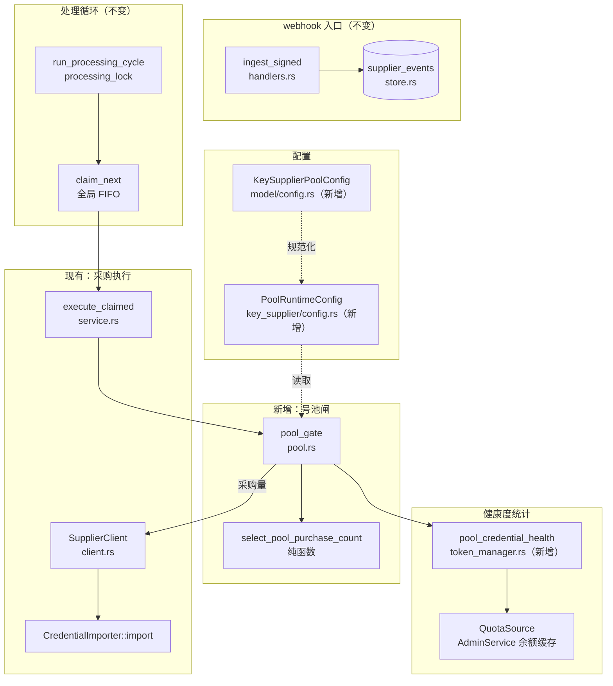
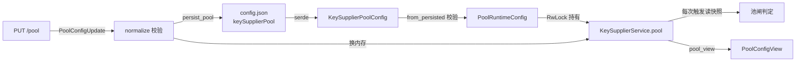
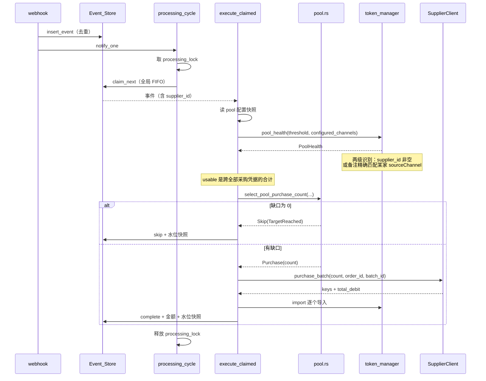

# Design Document

## Overview

在现有采购链路里插一道**全局号池水位闸**：任一供货商推来 `new_keys_available` 时，先统计所有采购来的可用凭据合计数，与配置的目标存量相减得出缺口，再把缺口当作「本次想买多少」交给现有的数量夹逼逻辑，只向推送方那一家下单。

「哪些号算采购来的」是这个设计里最关键也最容易出错的判定。已发布版本（v0.9.40）的 `credential_from_supplier_key` 写 `source_channel` / `nickname` / `groups` / `priority` / `rpm_limit` / `delete_on_forbidden`，但**不写 `supplier_id`**——该字段是本轮改造新增、尚未发版。若只按 `supplier_id` 统计，升级瞬间全部现存采购号都不被计入，缺口等于目标存量全额，会立刻重复买一批。因此识别规则做成两级：`supplier_id` 非空（新版，机器可判定），或 `supplier_id` 为空但 `source_channel` 与某家配置的 `sourceChannel` 精确相等（旧版遗留，靠备注识别）。

这个设计的核心取舍是**最小侵入**。现有链路已经具备本特性所需的三个关键性质，设计上选择依赖它们而不是重建：

| 需要的性质 | 现有实现 | 设计决策 |
| --- | --- | --- |
| 先到先得的处理顺序 | `claim_next` 的 `ORDER BY id ASC` 全局 FIFO | 直接依赖，不引入供货商排序 |
| 缺口不被两家同时吃掉 | `run_processing_cycle` 持有的单个 `processing_lock` | 直接依赖，不引入额度预留机制 |
| 采购幂等 | `purchase_order_id` 由 `event_id` 确定性派生并持久化 | 直接依赖，不新增订单号来源 |

因此新增代码集中在两处：一个**纯函数**算缺口与采购量，一个**跨供货商的健康度统计**。`execute_claimed` 里只多一个分支，采购与导入路径完全复用。

关键约束：`enabled = false` 时必须与上线前逐字节等价。设计上把池闸做成 `execute_claimed` 中一个提前 `return` 的独立分支，与现有逐家补货闸互斥而非嵌套，避免两套水位判定交叉出第三种行为。

## Architecture

### 组件与归属



### 文件级改动清单

| 文件 | 改动 | 理由 |
| --- | --- | --- |
| `src/model/config.rs` | 新增 `KeySupplierPoolConfig` 结构体 + `Config.key_supplier_pool` 字段 | 配置需要落在 `config.json` 顶层，与 `key_suppliers` 并列 |
| `src/admin/key_supplier/config.rs` | 新增 `PoolRuntimeConfig` 与 `normalize_pool`、`PoolConfigView`、`PoolConfigUpdate` | 沿用供货商配置「持久化结构 / 运行期结构 / 对外视图 / 入参」四层分离的既有模式 |
| `src/admin/key_supplier/pool.rs` | 新建。`select_pool_purchase_count`、`PoolDecision`、`PoolStatus` | 缺口计算是纯逻辑，独立文件便于属性测试 |
| `src/admin/key_supplier/service.rs` | `KeySupplierService` 加 `pool` 字段；`execute_claimed` 加池闸分支；新增 `pool_view` / `update_pool` / `pool_status` | 池闸必须在采购前生效 |
| `src/admin/key_supplier/store.rs` | 事件表加 3 列（`pool_usable`、`pool_deficit`、`pool_requested`） | 需求 9.1、9.2 要求记录触发时的水位快照，跳过与失败路径同样要写 |
| `src/admin/key_supplier/handlers.rs` | 新增 3 个 handler | 配置读写 + 状态查询 |
| `src/admin/router.rs` | 新增 3 条路由 | — |
| `src/kiro/token_manager.rs` | 新增 `classify_membership`、`PoolHealth`、`pool_credential_health` | 跨供货商统计，且要兼容已发布版本不写 `supplier_id` 的旧号 |
| `src/admin/key_supplier/service.rs`（trait） | `CredentialImporter` 加 `pool_health` 方法 | 服务层通过 trait 访问号池，保持测试可替换 |
| `src/main.rs` | 装配时加载池配置 | — |
| `admin-ui/src/types/api.ts` 等 | 类型 + 卡片 UI | — |

## Components and Interfaces

### 1. 配置层

`model/config.rs` 新增持久化结构。`enabled` 默认 `false` 是兼容性的关键——`#[serde(default)]` 让老 `config.json` 缺字段时整块结构取默认值，行为与上线前一致（需求 1.2、10.2）。

```rust
/// 全局号池采购配置。全实例一份，与 `key_suppliers` 并列在 config.json 顶层。
///
/// 启用后接管补货判定：各家自己的 `restockOnlyWhenExhausted` /
/// `restockUsableThreshold` / `lowQuotaThreshold` 不再参与，避免两套水位交叉。
#[derive(Clone, Debug, Serialize, Deserialize, PartialEq, Eq, Default)]
#[serde(rename_all = "camelCase")]
pub struct KeySupplierPoolConfig {
    /// 关闭（默认）时本特性完全不生效，逐家独立采购行为不变。
    #[serde(default)]
    pub enabled: bool,
    /// 目标存量 N：所有供货商名下可用凭据的合计上限。
    #[serde(default)]
    pub target_count: u32,
    /// 剩余额度 <= 此值不算可用。0 = 不看额度，只认封号与 402。
    #[serde(default)]
    pub low_quota_threshold: u32,
}
```

`target_count` 默认 0 而非 1：0 是「未配置」的哨兵值，配合需求 6.6「阈值不可用则跳过采购」构成失效保护——有人手工把 `enabled` 改成 `true` 却忘了填数量时，结果是不买，而不是按某个默认值开始花钱。

`key_supplier/config.rs` 的运行期结构与校验，沿用 `SupplierRuntimeConfig::normalize` 的写法：

```rust
pub const MAX_POOL_TARGET: u64 = 10_000;

#[derive(Clone, Debug, PartialEq, Eq, Default)]
pub struct PoolRuntimeConfig {
    pub enabled: bool,
    pub target_count: u32,
    pub low_quota_threshold: u32,
}

impl PoolRuntimeConfig {
    /// 校验并规范化。`enabled` 为假时不校验数值——关闭状态下的脏数据不该阻塞启动。
    pub fn normalize(update: PoolConfigUpdate) -> anyhow::Result<Self>;

    /// 从持久化结构读取。校验失败时返回 Err，由调用方决定是禁用还是拒绝启动。
    pub fn from_persisted(config: &KeySupplierPoolConfig) -> anyhow::Result<Self>;
}
```

`enabled = false` 时跳过数值校验是刻意的：否则一份历史遗留的 `targetCount: 0` 会让启动直接失败，而那份配置本来就不生效。

启动时的失效路径（需求 1.8）：`from_persisted` 返回 `Err` → `main.rs` 记 error 日志 → 装配一个 `enabled = true` 且 `target_count = 0` 的**中毒配置**。这样后续每次触发都会命中「阈值不可用」跳过，而不是静默退回逐家采购模式偷偷花钱。这一点与「校验失败就禁用」的直觉相反，但方向正确：配置写错时用户的意图明显是要限制采购，此时退回不限制模式是最坏结果。

### 2. 采购凭据的识别与跨供货商健康度统计

这是设计里唯一需要新引入判定规则的地方，也是最需要写清楚的地方。

#### 识别规则

现有 `supplier_credential_health` 按单个 `supplier_id` 精确过滤。全局版本不能简单改成「`supplier_id` 非空」，因为已发布版本采购时不写这个字段。识别条件做成一个独立的纯函数，便于单测与属性测试：

```rust
/// 凭据是否算在号池水位里，以及是靠什么认出来的。
///
/// 只回答「是不是自动采购来的」，**不回答「来自哪一家」**——水位是全局的，
/// 归属信息对缺口计算没有任何作用。区分两种识别方式仅为可观测性：备注匹配
/// 那条规则有已知弱点，不分开计数就看不出它何时失效。
#[derive(Debug, Clone, Copy, PartialEq, Eq)]
pub enum PoolMembership {
    /// `supplier_id` 非空。新版采购写入的机器可判定标记，与该 id 是否仍在配置里无关。
    BySupplierId,
    /// `supplier_id` 为空，但 `source_channel` 与某家配置的 `sourceChannel` 精确相等。
    ///
    /// 已发布版本（v0.9.40）采购时只写 `source_channel`，`supplier_id` 字段那时
    /// 还不存在。不认这一类的话，升级瞬间全部现存采购号都统计不到，缺口等于目标
    /// 存量全额，会立刻重复买一批。
    ByLegacySourceChannel,
    /// 不算采购号。手动添加、批量导入，或备注不匹配任何已配置供货商。
    NotPurchased,
}

/// 判定一个凭据是否算在号池水位里。
///
/// `configured_channels` 是当前所有已配置供货商的 `sourceChannel` 去重集合，
/// **已剔除空串**——空串会命中所有无备注凭据，等于把手工号全算进池子。
///
/// 备注匹配要求完全相等：不做前缀、子串或大小写不敏感匹配。放宽任何一项都会让
/// 用户随手写的备注被算进水位，从而把缺口顶掉、该补货时不补。
pub fn classify_membership(
    supplier_id: Option<&str>,
    source_channel: Option<&str>,
    configured_channels: &HashSet<String>,
) -> PoolMembership;
```

这条规则有个已知弱点：若某家的 `sourceChannel` 在那批号买回来**之后**被改过，旧号就不再匹配，会少算进而买超。设计上不试图消除它（可靠消除需要一次性回填 `supplier_id`，而默认 `sourceChannel` 三家相同、无法归属到具体某家，见需求 D11），改为**让它可见**：状态接口把两类归属分开计数，界面上出现 Legacy 计数骤降时能直接定位原因。

#### 统计函数

```rust
impl MultiTokenManager {
    /// 全部采购来的凭据的合计可用情况，用于全局号池水位判定。
    ///
    /// `configured_channels` 见 `classify_membership`。调用方负责剔除空串。
    ///
    /// 返回值在 `SupplierCredentialHealth` 之外额外给出两类归属的计数，供状态
    /// 接口解释「这些号是怎么认出来的」。
    pub fn pool_credential_health(
        &self,
        low_quota_threshold: f64,
        configured_channels: &HashSet<String>,
        remaining_quota: &dyn Fn(u64) -> Option<f64>,
    ) -> PoolHealth;
}

pub struct PoolHealth {
    /// 合计可用/不可用拆分，语义与 `SupplierCredentialHealth` 一致。
    /// `usable` 就是 Global_Usable_Count；`dead` 是判死但尚未被保留期清理的号。
    pub health: SupplierCredentialHealth,
    /// 靠 `supplier_id` 认出来的凭据数。
    pub by_supplier_id: usize,
    /// 靠备注认出来的凭据数（旧版采购遗留）。
    pub by_legacy_channel: usize,
}
```

**不按供货商拆分。** 水位是全局的，缺口只看合计，归属信息对判定没有任何作用；而且下单对象恒为推送方那一家，拆分出来也指导不了任何决策。只保留两种识别方式的计数，用于诊断备注匹配是否失效。

判死的号计入 `health.dead` 而不是 `health.usable`——判死后凭据先禁用留档、保留期到点才删，这段时间它还占着池子的位置，但对流量而言已经是废号。算成可用会导致「号死了不补货、池子一路缩到 0」。

实现沿用现有的两阶段写法——先在 `entries` 锁内只收集 `(id, membership, died, quota_exhausted)`，出锁后再查额度（需求 3.9）。这不是风格问题：`remaining_quota` 闭包会去拿 `AdminService` 的 `balance_cache` 锁，在 `entries` 锁内调用外部闭包就是一条死锁路径，现有 `supplier_credential_health` 的注释已经点明，新函数必须照做。

#### trait 侧

```rust
pub trait CredentialImporter: Send + Sync {
    // ... 现有方法不变 ...

    /// 全部采购凭据的合计可用统计，用于全局号池水位判定。
    ///
    /// 默认实现返回全零——测试替身不关心号池时不必实现。生产实现必须覆盖，
    /// 否则全局可用数恒为 0、缺口恒等于目标存量，会持续买到上限。
    fn pool_health(&self, _low_quota_threshold: f64, _channels: &HashSet<String>) -> PoolHealth {
        PoolHealth::default()
    }
}
```

默认实现返回全零有一个危险的失效方向：合计为 0 意味着缺口最大。这里接受这个风险，因为唯一的生产实现 `TokenManagerCredentialImporter` 会覆盖它，而漏覆盖会被一个专门的「生产实现必须覆盖 pool_health」契约测试挡住。替代方案是把方法设成无默认实现，但那会迫使 `service.rs` 里十几个测试替身全部改动，与本特性无关的改动面反而更大。

`configured_channels` 由 `KeySupplierService` 从 `suppliers` 读锁内取出并去重剔空后传入，不由 `token_manager` 自己去拿供货商配置——`token_manager` 不该依赖供货商模块，反向依赖会形成环。

### 3. 缺口计算（纯函数）

新建 `pool.rs`，只放不依赖 I/O 的判定逻辑，便于属性测试直接覆盖需求 11：

```rust
/// 号池闸的判定结果。
#[derive(Debug, Clone, Copy, PartialEq, Eq)]
pub enum PoolDecision {
    /// 按这个数量向推送方下单。
    Purchase(u32),
    /// 跳过，附机器可判定的原因。
    Skip(PoolSkipReason),
}

#[derive(Debug, Clone, Copy, PartialEq, Eq)]
pub enum PoolSkipReason {
    /// 目标存量未配置或为 0（失效保护，宁可不买）。
    TargetUnavailable,
    /// 全局可用数已达或超过目标存量。
    TargetReached,
    /// 缺口夹逼后低于该家 minPurchase。
    BelowSupplierMinimum,
    /// 该家库存不足（仅 kiro-rs 会先查库存）。
    SupplierOutOfStock,
}

/// 缺口 = 目标存量 - 全局可用数，下界截断到 0。
pub fn deficit(target_count: u32, global_usable: usize) -> u32;

/// 由缺口推出实际采购量。
///
/// 夹逼顺序：缺口 → 该家可用库存 → 该家 maxPurchase，再与 minPurchase 比。
/// 低于 minPurchase 时**放弃**而不放大到 minPurchase——放大会买超目标存量，
/// 那正是这道闸要防的事。
pub fn select_pool_purchase_count(
    target_count: u32,
    global_usable: usize,
    available_stock: u64,
    max_purchase: u32,
    min_purchase: u32,
) -> PoolDecision;
```

`select_pool_purchase_count` 内部复用现有的 `select_purchase_count(deficit, stock, max, min)`：把缺口当作「想买多少」传进去，现有函数已经实现了「取三者最小、低于下限则跳过」的语义。这样夹逼规则只有一份实现，不会出现两套逻辑对 `minPurchase` 边界的处理漂移。区别只在返回值——现有函数的 `CountDecision::Skip` 不带原因，池闸需要区分 `TargetReached` 与 `BelowSupplierMinimum` 才能满足需求 8.3 的「跳过原因可区分」，所以在外层包一层。

### 4. 服务层接入

`KeySupplierService` 加一个字段，与 `suppliers` 同样用 `RwLock` 持有，写路径同样由 `config_update_lock` 串行化：

```rust
pub struct KeySupplierService {
    // ... 现有字段不变 ...
    /// 全局号池配置。读多写少，与 `suppliers` 同构。
    pool: parking_lot::RwLock<PoolRuntimeConfig>,
}
```

新增三个公开方法，签名与现有供货商配置接口对称：

```rust
impl KeySupplierService {
    pub fn pool_view(&self) -> PoolConfigView;

    /// 校验 → 落盘 → 换内存。落盘走 `persist_pool`，与 `persist_suppliers`
    /// 同一条 config.json 读改写路径（需求 1.7）。
    pub fn update_pool(&self, update: PoolConfigUpdate)
        -> Result<PoolConfigView, SupplierServiceError>;

    /// 只读状态：当前目标存量、全局可用数、缺口、两类归属计数、按供货商拆分的明细。
    /// 不发起任何采购，不产生写操作（需求 9.6、9.9）。
    pub fn pool_status(&self) -> Result<PoolStatus, SupplierServiceError>;

    /// 当前所有已配置供货商的 `sourceChannel` 去重集合，已剔除空串。
    /// 供备注匹配使用——空串会命中所有无备注凭据（需求 2.6）。
    fn configured_source_channels(&self) -> HashSet<String>;
}
```

`persist_pool` 与 `persist_suppliers` 必须共用同一把 `config_update_lock`。这两个操作都是 `Config::load` → 改 → `save()` 的全量读改写，各自加锁只能防住自己并发，防不住彼此——同时改供货商和池配置会丢一方。这个缺陷在项目里更大范围地存在（`token_manager` 有约 12 处同样写法），本特性不修，但至少不新增一个不受同一把锁保护的写入点。

### 5. `execute_claimed` 的分支

池闸插在「白名单判定 + 供货商查找 + autoPurchase 判定」之后、「逐家补货闸」之前，两道闸互斥：

```rust
// 现有：事件类型白名单 → 供货商查找 → autoPurchase / enabled 判定 → importer 取出

let pool = self.pool.read().clone();   // 配置快照，本次触发用完（需求 4.6）

if pool.enabled && event.event_type == "new_keys_available" {
    // 全局号池模式：缺口说了算，各家自己的补货闸不参与（需求 6.2）
    // 备注匹配集合从供货商配置取，去重并剔空——空串会命中所有无备注凭据。
    let channels = self.configured_source_channels();
    let pool_health = importer.pool_health(f64::from(pool.low_quota_threshold), &channels);
    let stock = /* kiro-rs 查库存；两家 kiroapp 用 max_purchase 占位 */;
    match select_pool_purchase_count(
        pool.target_count, pool_health.health.usable, stock,
        runtime.max_purchase, runtime.min_purchase,
    ) {
        PoolDecision::Purchase(count) => /* 带着 count 走既有采购路径 */,
        PoolDecision::Skip(reason) => return Ok(ProcessAction::SkipWithReason(reason.as_str())),
    }
} else if event.event_type == "new_keys_available" && runtime.restock_only_when_exhausted {
    // 现有逐家补货闸，一字不改
}
```

`event_type == "new_keys_available"` 的双重判断是刻意的：`manual_purchase` 事件不能落进池闸（需求 5.6 手动采购不受约束），而现有代码的补货闸也正是用同一个条件排除手动采购的。把两个分支写成同一个 `if/else if` 而不是嵌套，保证 `enabled = false` 时控制流与改动前完全一致。

库存查询保持现有的按 `kind` 分叉（需求 3.5、3.6）：只有 `kiro-rs` 打 `available_stock()`，两家 kiroapp 直接下单——它们的文档明确建议不要先查库存，查询与领取不在同一事务，多一次往返只会把货让给别人。传给纯函数的 `available_stock` 在这两家用 `max_purchase` 占位，使该项夹逼变成无操作。

### 6. HTTP 接口

| 方法 | 路径 | 用途 |
| --- | --- | --- |
| `GET` | `/api/admin/key-supplier/pool` | 读配置 |
| `PUT` | `/api/admin/key-supplier/pool` | 写配置 |
| `GET` | `/api/admin/key-supplier/pool/status` | 读状态（目标存量 / 可用数 / 缺口 / 按家明细） |

三条都挂在现有 `authenticated` 路由组下，继承 `admin_auth_middleware`。**不新增任何公开端点**——webhook 入口不变，池配置属于管理操作。

`PoolConfigView` 与 `PoolConfigUpdate` 字段相同（`enabled` / `targetCount` / `lowQuotaThreshold`），没有 secret，因此不需要供货商配置那套「写入时留空不覆盖」的处理。

`PoolStatus` 响应形状：

```rust
#[derive(Serialize)]
#[serde(rename_all = "camelCase")]
pub struct PoolStatus {
    pub enabled: bool,
    pub target_count: u32,
    pub global_usable: usize,
    pub deficit: u32,
    /// 四类不可用拆分，解释「为什么可用数比池里的号少」。
    /// `dead` 是判死但尚未被保留期清理的号——它们占位置但不算可用。
    pub health: SupplierCredentialHealth,
    /// 靠 `supplier_id` 认出来的凭据数。
    pub by_supplier_id: usize,
    /// 靠 `sourceChannel` 备注认出来的凭据数（旧版采购遗留）。
    pub by_legacy_channel: usize,
    /// 当前参与备注匹配的 `sourceChannel` 集合，让「为什么某批号没算进来」可自查。
    pub matched_channels: Vec<String>,
}
```

响应里没有按供货商的拆分，理由同上：水位是全局的，拆分指导不了任何决策。剩下三处字段各自回答一个用户会真的问出来的问题：

- `health` 的四类拆分回答「池子里明明有 10 个号，怎么可用数只有 3」——通常答案是判死了 5 个、额度耗尽 2 个。
- `by_supplier_id` 与 `by_legacy_channel` 回答「备注匹配是不是还在生效」。后者突然掉到 0，基本就是有人改了某家的 `sourceChannel`。
- `matched_channels` 回答「我买的号怎么没算进去」——对着这个列表和凭据的备注一比就有答案，不用看日志或翻代码。

### 7. 事件表新增列

```sql
ALTER TABLE supplier_events ADD COLUMN pool_usable INTEGER;    -- 触发时的全局可用数
ALTER TABLE supplier_events ADD COLUMN pool_deficit INTEGER;   -- 触发时的缺口
ALTER TABLE supplier_events ADD COLUMN pool_requested INTEGER; -- 夹逼后的请求量
```

三列都可空：`enabled = false` 时不写，历史行天然为 `NULL`。走现有 `MIGRATION_COLUMNS` 的逐列 `ALTER` 机制，同时补进 `REBUILD_TABLE` 的列清单与 `EVENT_COLUMNS`，与刚加的四个金额列同样的处理。

写入时机与金额字段一致：装进 `ProcessSummary`，由 `transition_processing` 一次性落库。跳过路径（`skip`）也要带上这三个数——「为什么没买」正是这三个数字要回答的问题，只在成功时记录等于没记录。这需要给 `store.skip` 增加一个带 summary 的变体，或让池闸走 `ProcessAction::SkipWithReason` 时携带 summary。设计上选后者：给 `ProcessAction` 的 `SkipWithReason` 加一个 `ProcessSummary` 字段，比新增 store 方法改动面小。

## Data Models

### 配置数据流



四层分离沿用供货商配置的既有模式：持久化结构只管 serde 与默认值，运行期结构只装校验过的值，视图只对外，入参只接收。这样「校验」只有一处入口，不会出现某条路径绕过校验直接写内存。

### 判定数据流



`processing_lock` 覆盖整轮取件与下单，这是「缺口不被两家同时吃掉」的唯一保证。第二家的事件在同一轮里被 `claim_next` 取出时，第一家导入的凭据已经进池，`pool_health` 重新统计就会看到缺口已归零（需求 3.7、5.5）。

这个保证有个前提：`importer.import()` 必须在返回时凭据已经可被 `pool_health` 看到。现有 `add_credential` 是同步写 `entries` 再落盘，满足这个前提。设计上把它写成一条显式约束，因为如果将来把导入改成异步排队，池闸会立刻开始买超——这是本特性最脆弱的耦合点，需要在实现时留下注释与一个专门的测试。

## Error Handling

| 情况 | 处理 | 事件状态 | 依据 |
| --- | --- | --- | --- |
| `enabled = false` | 走原有逐家路径 | 不变 | 需求 11.1 |
| `target_count = 0` 或不可解析 | 跳过采购 | `skipped` / 「目标存量不可用」 | 需求 7.6 |
| 启动时池配置校验失败 | 记 error 日志，装配中毒配置使后续全部跳过 | `skipped` / 「配置非法」 | 需求 1.8 |
| 缺口为 0 | 跳过采购 | `skipped` / 「号池已达目标存量」 | 需求 4.2 |
| 缺口 < `minPurchase` | 跳过采购，不放大 | `skipped` / 「低于单家下限」 | 需求 4.7 |
| 可用数 > 目标存量 | 跳过采购，不处置多余凭据 | `skipped` / 「号池已达目标存量」 | 需求 4.10、D10 |
| 备注不匹配任何已配 `sourceChannel` | 该凭据不计入水位（不是错误） | — | 需求 2.5 |
| 某家 `sourceChannel` 为空 | 该空值不参与匹配，不吞掉无备注凭据 | — | 需求 2.7 |
| 凭据已判死但仍在保留期内 | 计入 `dead`、不计入可用，缺口会去补新的 | — | 需求 3.2、3.3 |
| `OutOfStock` | 沿用现有语义 | `skipped` / 「库存已被抢完」 | 需求 8.1 |
| `InsufficientBalance` | 沿用现有语义 | `skipped` / 「供货商积分不足，需充值」 | 需求 8.2 |
| `OrderConflict` | 沿用现有语义 + error 日志 | `skipped` / 需人工核对 | 需求 8.3 |
| API 故障（超时 / 5xx / 429） | 记失败，缺口留给下次推送 | `failed` | 需求 8.4 |
| 导入部分失败 | 走 `fail_with_summary`，金额与水位快照都不被抹 | `failed` | 需求 8.5 |
| `QuotaSource` 未注入 | 额度水位不生效，查不到额度的号算可用 | 正常 | 需求 11.4 |
| 推送方已被删除 | 跳过，不下单 | `failed`（现有 `SupplierNotFound` 行为） | 需求 11.5 |
| 推送方 `is_operable()` 为假 | 跳过 + warn 日志 | `skipped` | 需求 11.7 |

跳过原因需要在事件的 `message` 里可区分（需求 9.4）。`PoolSkipReason::as_str()` 返回固定中文串，与现有 `SkipWithReason` 的用法一致——这些串会进事件表被界面直接展示，不做 i18n 与现有代码保持一致。

## Correctness Properties

缺口计算与凭据识别都被刻意做成不依赖 I/O 的纯函数，就是为了让下面这组不变式能被属性测试直接覆盖。它们对应需求 12，是本特性「不买超」这个承诺的可执行形式。

### Property 1: 目标存量不变式

∀ `target ∈ 1..=10000`, ∀ `usable`, ∀ `stock`, ∀ `max`, ∀ `min`：若 `select_pool_purchase_count(...) = Purchase(n)`，则 `usable + n <= target`。

**Validates: Requirements 12.1, 4.1, 4.3**

这是全组属性里唯一真正重要的一条——它直接等于「不会花超」。其余各条要么是它的分解，要么是防止某类错误实现绕过它。

### Property 2: 缺口非负

∀ `target`, ∀ `usable`：`deficit(target, usable) >= 0`。

**Validates: Requirements 12.2, 4.1**

`u32` 返回类型已经保证，测试的意义在于将来若有人把签名改成有符号类型，截断逻辑丢失会立刻被发现。

### Property 3: 单家上限

若结果为 `Purchase(n)`，则 `n <= max_purchase`。

**Validates: Requirements 12.3, 4.4**

全局缺口再大也不能突破单家的单笔安全边界。

### Property 4: 下限二值性

结果要么是 `Skip`，要么是 `Purchase(n)` 且 `n >= min_purchase`。不存在 `0 < n < min_purchase` 的结果。

**Validates: Requirements 12.4, 4.7**

这条排除了一个很自然但错误的实现：缺口小于 `minPurchase` 时把数量放大到 `minPurchase` 去凑单。那样做每次都会买超目标存量，而且缺口越小超得越多。

### Property 5: 库存上限

若结果为 `Purchase(n)`，则 `n <= available_stock`。

**Validates: Requirements 4.5, 4.6**

仅对 `kiro-rs` 有实质约束；两家 kiroapp 传入 `max_purchase` 占位使该项夹逼成为无操作。

### Property 6: 确定性

同一组入参重复调用 `select_pool_purchase_count` 产生相同的 `PoolDecision`。

**Validates: Requirements 12.6**

纯函数无隐藏状态，这条同时锁住「不引入跨触发轮转游标」这个设计决策。

### Property 7: 幂等键确定性

同一 `event_id` 与同一供货商 id 重复派生 `purchase_order_id` 得到相同值。

**Validates: Requirements 12.7, 7.2, 7.4**

这是本特性沿用现有派生逻辑、不新增订单号来源的原因：一旦引入随机订单号，重启后重放同一事件就会向供货商发起第二笔不同订单号的采购，幂等保护失效、钱被扣两次。

### Property 8: 配置往返

∀ 合法 `KeySupplierPoolConfig`：`from_json(to_json(c)) == c`。

**Validates: Requirements 12.8, 1.2, 11.2**

防止 serde 字段名或默认值改动导致线上配置读不回来——这类回归在本项目的 `SupplierKind` 上已经有过一次，现有测试就是为此加的。

### Property 9: 序列化消耗

∀ 到货推送序列：串行处理完整个序列后，`global_usable <= target_count`。

**Validates: Requirements 12.9, 5.3, 5.4, 5.5**

这条不是纯函数属性，需要在服务层用测试替身模拟「导入后可用数增加」来验证。它是 Property 1 在时间维度上的推论，成立前提是 `processing_lock` 串行化与每次触发重算缺口同时为真——单看任一次触发满足 Property 1 并不能推出整个序列满足这一条。

### Property 10: 识别规则的顺序无关性

∀ 凭据集合、∀ 已配置 `sourceChannel` 集合：`classify_membership` 的逐个判定结果与凭据在集合中的遍历顺序无关，且 `PoolHealth` 各项计数对输入集合的任意置换都相同。

**Validates: Requirements 12.5, 2.2, 2.3**

这条约束的是实现方式而不只是结果：它排除「按遍历顺序累积状态」的写法。识别必须是逐个凭据独立的纯判定。

### Property 13: 死号不占额度

∀ 凭据集合：`PoolHealth.health.usable` 不包含任何 `died_at` 非空的凭据，且这些凭据全部落进 `PoolHealth.health.dead`。

**Validates: Requirements 12.10, 3.2, 3.3**

判死后凭据先禁用留档、保留期到点才被清理删除。这段时间它还在 `entries` 里占位置，若算成可用就会出现「号死了不补货、池子一路缩到 0」——而缺口显示为 0，看起来一切正常。

### Property 11: 备注匹配不吞空值

∀ 凭据：若某家配置的 `sourceChannel` 为空字符串，则该空值不使任何 `source_channel` 为空的凭据被判定为 Purchased_Credential。

**Validates: Requirements 2.5, 2.6**

单独立为属性是因为这是最容易写错、错了以后后果最严重的一处：空串参与匹配会把所有无备注凭据（包括全部手工号）算进水位，缺口被顶成 0，该补货时永远不补——表现为「自动采购静默失效」，而日志里只有一条「号池已达目标存量」，极难定位。

### Property 12: 备注匹配的精确性

∀ 凭据、∀ 已配置 `sourceChannel` 集合：若 `source_channel` 与集合中任一元素只是前缀关系、子串关系或仅大小写不同，则该凭据 SHALL NOT 被判定为 Legacy_Purchased_Credential。

**Validates: Requirements 2.3**

防止实现里用 `starts_with` / `contains` / `eq_ignore_ascii_case` 图方便。放宽匹配会让「Webhook 自动采购（临时）」这类用户自己写的备注意外命中默认值，把手工号算进水位。

## Testing Strategy

### 属性测试（`pool.rs`）

Property 1 到 8、10 到 13 直接对纯函数做属性测试，不需要任何 mock。Property 9 依赖串行化与重算，归入下面的集成测试。

### 单元与集成测试

沿用 `service.rs` 现有的 `FakeImporter` + `axum` 本地 server 模式。新增替身需要能设定 `pool_health` 返回值。

必须覆盖的场景：

1. `enabled = false` 时采购量与改动前逐字节相同（兼容性回归的主防线）。
2. 缺口为 0 时不发出任何 HTTP 请求——用请求计数断言，不能只看事件状态。
3. 两家先后推送、缺口为 1：先处理的买到，后处理的跳过。这条验证 `processing_lock` + 重算缺口的组合，是先到先得语义的核心测试。
4. 池闸启用时，各家自己的 `restockOnlyWhenExhausted` 被忽略（配一个会阻止采购的逐家水位，断言仍然采购）。
5. 手动采购不受目标存量约束，且事件被标注未经号池引擎。
6. 已删除或已禁用供货商名下的遗留凭据计入全局可用数（构造一个 `supplier_id` 指向不存在 id 的凭据）。
6.1 判死的凭据不计入可用数：构造若干 `died_at` 非空的采购凭据，断言 `usable` 不含它们、`dead` 含它们，且缺口据此去补新号。
7. **升级场景**：凭据只有 `source_channel = "Webhook 自动采购"`、`supplier_id` 为空，且某家配置的 `sourceChannel` 正是该值 → 必须计入。这条直接对应「已发布版本不写 `supplier_id`」这个事实，是防止升级后立刻重复买一批的唯一防线。
8. 手动添加的凭据（`supplier_id` 为空、备注为自定义值或为空）不计入。
9. 某家 `sourceChannel` 配成空串时，无备注的手工凭据不被算入水位。
10. 备注只差大小写、或只是默认值的前缀/超集时不计入（对应 Property 12）。
11. 某家的 `sourceChannel` 被改掉后，该家旧号从 Legacy 计数中消失、`by_supplier_id` 计数不变——用于确认这个已知弱点的表现是可观测的，而不是静默的。
12. 启动时池配置非法 → 后续触发全部 `skipped`，且不退回逐家采购。
13. 事件表的三个水位列在 `skipped` 与 `failed` 路径上同样被写入。
14. 生产实现 `TokenManagerCredentialImporter` 覆盖了 `pool_health`（契约测试，防止依赖返回全零的默认实现）。
15. `pool_status` 重复调用不改变系统状态、不发 HTTP 请求，且 `matchedChannels` 与两类归属计数如实反映当前配置。

### 前端测试

沿用 `bun test` + 契约测试模式：类型往返、取值范围校验禁用保存、Legacy 提示在存在旧版采购号时出现、四类不可用拆分与两类识别计数正确渲染。

## 与既有缺陷的共存

本特性不修这些缺陷，但设计上必须不放大它们：

| 缺陷 | 本特性的影响 | 缓解 |
| --- | --- | --- |
| 队头阻塞（全局 FIFO + 单 `processing_lock`） | 池闸多一次 `pool_health` 统计，在 `entries` 锁内 | 只收集三元组、锁外查额度，统计是内存遍历，相对 15s 网络超时可忽略 |
| `config.json` 全量读改写无共享锁 | 新增一个写入点 | `persist_pool` 与 `persist_suppliers` 共用 `config_update_lock` |
| 事件表零清理 | 每行多 3 列 | 三列均为整数且可空，增量可忽略 |
| 事件层无自动重试 | API 故障时缺口留到下次推送 | 需求 8.4 明确接受；若对方不再推送则需人工触发手动采购 |
| 导入必须同步可见 | 池闸正确性依赖此前提 | 写成显式约束 + 专门测试（见 Data Models 末段） |
