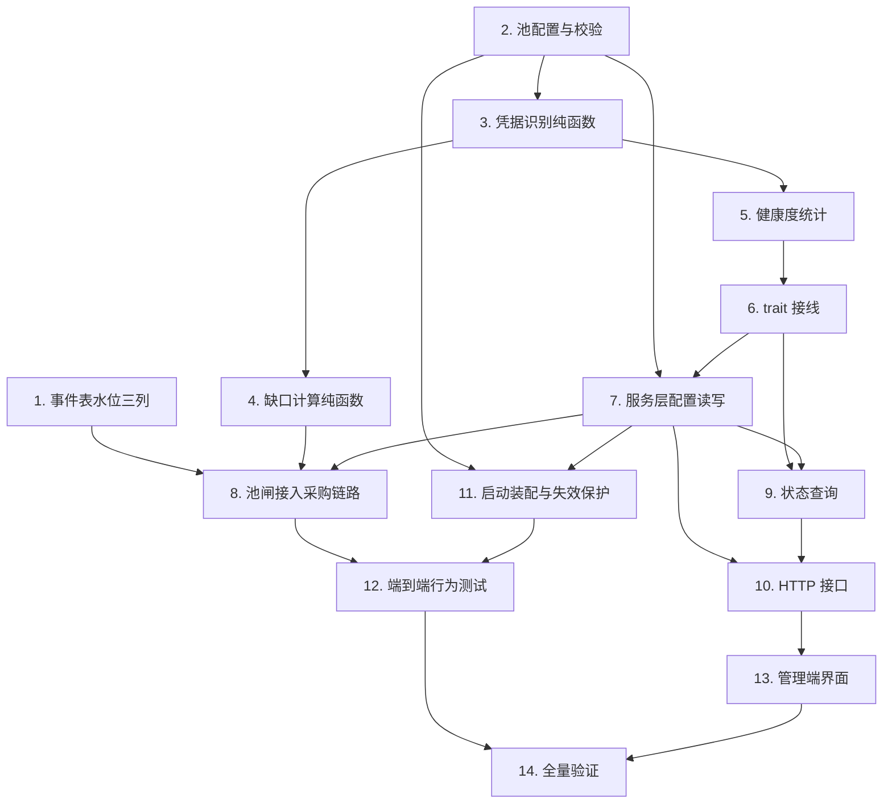

# Implementation Plan

## Overview

任务顺序是自下而上的：先把不依赖 I/O 的纯逻辑连同属性测试写完，再往上接统计、服务、接口、界面。这样「不买超」这条核心不变式在最早一步就被测试锁住，后续每一层接错都会立刻失败而不是等到线上花钱。

三条主线可以并行推进，互不阻塞：

- **A 线（数据底座）**：任务 1，事件表水位列
- **B 线（纯逻辑）**：任务 2 → 3 → 4，配置校验、凭据识别、缺口计算
- **C 线（统计）**：任务 5 → 6，跨采购凭据的健康度统计与 trait 接线

三线汇合于任务 7、8（服务层接入），之后才是接口与界面。

## Task Dependency Graph



关键路径是 `2 → 3 → 5 → 6 → 7 → 8 → 12 → 14`。任务 1 与任务 2 可以最先并行开工。

同一 wave 内的任务互不依赖，可并行执行：

```json
{
  "waves": [
    {
      "wave": 1,
      "tasks": ["1", "2"],
      "rationale": "事件表加列与池配置结构互不相干，都不依赖其它任务"
    },
    {
      "wave": 2,
      "tasks": ["3"],
      "rationale": "凭据识别需要池配置里的 sourceChannel 集合类型先就位"
    },
    {
      "wave": 3,
      "tasks": ["4", "5"],
      "rationale": "缺口计算与健康度统计都只依赖识别规则，彼此独立"
    },
    {
      "wave": 4,
      "tasks": ["6"],
      "rationale": "trait 接线需要统计函数已存在"
    },
    {
      "wave": 5,
      "tasks": ["7"],
      "rationale": "服务层配置读写需要池配置与 trait 都就位"
    },
    {
      "wave": 6,
      "tasks": ["8", "9", "11"],
      "rationale": "池闸接入、状态查询、启动装配都只依赖服务层字段与纯函数，互不冲突"
    },
    {
      "wave": 7,
      "tasks": ["10"],
      "rationale": "HTTP 接口需要服务层方法与状态结构都已定义"
    },
    {
      "wave": 8,
      "tasks": ["12", "13"],
      "rationale": "端到端测试与前端界面分别依赖后端行为与 HTTP 接口，可并行"
    },
    {
      "wave": 9,
      "tasks": ["14"],
      "rationale": "全量验证必须在所有实现完成后执行"
    }
  ]
}
```

## Tasks

- [x] 1. 事件表加水位快照三列
- [x] 1.1 在 `store.rs` 的 `SCHEMA`、`MIGRATION_COLUMNS`、`REBUILD_TABLE`、`EVENT_COLUMNS` 中加入 `pool_usable INTEGER`、`pool_deficit INTEGER`、`pool_requested INTEGER`
  - 三列均可空：`enabled = false` 时不写，历史行天然为 `NULL`
  - 走现有逐列 `ALTER` 机制，并同步补进整表重建的列清单，防止历史库重建时丢列
  - _Requirements: 9.1_
- [x] 1.2 在 `StoredSupplierEvent` 与 `ProcessSummary` 中加入对应字段，并扩展 `transition_processing` 的 UPDATE 语句
  - 金额列已有的 `COALESCE` 只写不抹策略同样适用于这三列
  - _Requirements: 9.1, 9.2_
- [x] 1.3 给 `ProcessAction::SkipWithReason` 增加 `ProcessSummary` 字段，使跳过路径也能落水位快照
  - 「为什么没买」正是这三个数要回答的问题，只在成功时记录等于没记录
  - 改完后更新 `process_claimed` 中该分支对 `store.skip` 的调用
  - _Requirements: 9.2_
- [x] 1.4 更新 `store.rs` 现有测试并补一条断言：跳过与失败路径上三列同样被写入
  - _Requirements: 9.2_

- [x] 2. 池配置的持久化、校验与往返
- [x] 2.1 在 `model/config.rs` 新增 `KeySupplierPoolConfig`（`enabled` / `target_count` / `low_quota_threshold`）与 `Config.key_supplier_pool` 字段
  - 整块结构 `#[serde(default)]`，使缺字段的老 `config.json` 取 `enabled = false`
  - `target_count` 默认 0 作为「未配置」哨兵，配合失效保护
  - _Requirements: 1.1, 1.2, 11.2_
- [x] 2.2 在 `key_supplier/config.rs` 新增 `PoolRuntimeConfig`、`PoolConfigView`、`PoolConfigUpdate` 与 `MAX_POOL_TARGET`
  - `normalize` 在 `enabled = false` 时跳过数值校验，避免历史脏数据阻塞启动
  - `from_persisted` 校验失败返回 `Err`，由调用方决定失效方向
  - _Requirements: 1.3, 1.4, 1.9_
- [x] 2.3 写配置校验的单元测试与序列化往返属性测试
  - 覆盖 `targetCount` 越界、`lowQuotaThreshold` 越界、`enabled = false` 时不校验、缺字段取默认
  - _Requirements: 1.3, 1.4, 12.8_

- [x] 3. 凭据识别纯函数
- [x] 3.1 在 `token_manager.rs` 新增 `PoolMembership` 枚举与 `classify_membership` 纯函数
  - 只判定「是否自动采购来的」，不判定来自哪一家
  - 两级判定：`supplier_id` 非空 → `BySupplierId`（与该 id 是否仍在配置里无关）；`supplier_id` 为空且 `source_channel` 与 `configured_channels` 中某项完全相等 → `ByLegacySourceChannel`；否则 `NotPurchased`
  - 完全相等匹配，禁止 `starts_with` / `contains` / `eq_ignore_ascii_case`
  - 函数内不再剔空串，由调用方保证 `configured_channels` 已剔空（契约写进文档注释）
  - _Requirements: 2.1, 2.2, 2.3, 2.4, 2.5, 2.6_
- [x] 3.2 写 `classify_membership` 的属性测试
  - 顺序无关性：任意置换输入集合，逐个判定结果与计数不变
  - 空值不吞：`configured_channels` 含空串时（防御性输入）无备注凭据不被判为采购号
  - 精确性：只差大小写、或互为前缀/子串的备注不命中
  - _Requirements: 12.5, 2.4, 2.6, 2.7_
- [x] 3.3 写升级场景的单元测试
  - 构造只有 `source_channel = "Webhook 自动采购"`、`supplier_id` 为空的凭据，配一家 `sourceChannel` 为该值的供货商，断言判为 `ByLegacySourceChannel`
  - 这条对应「已发布版本不写 `supplier_id`」这个事实，是防止升级后重复买一批的唯一防线
  - _Requirements: 2.3, 11.3_

- [x] 4. 缺口计算纯函数
- [x] 4.1 新建 `src/admin/key_supplier/pool.rs`，实现 `deficit`、`PoolDecision`、`PoolSkipReason`、`select_pool_purchase_count`
  - 内部复用现有 `select_purchase_count(deficit, stock, max, min)`，使夹逼规则只有一份实现
  - 外层包一层把 `CountDecision::Skip` 细化成可区分的 `PoolSkipReason`
  - `PoolSkipReason::as_str()` 返回固定中文串，供事件 message 直接展示
  - _Requirements: 4.1, 4.2, 4.3, 4.4, 4.7, 4.10, 7.6_
- [x] 4.2 在 `mod.rs` 中注册 `pool` 模块
  - _Requirements: 4.1_
- [x] 4.3 写缺口计算的属性测试
  - 目标存量不变式、缺口非负、单家上限、下限二值性、库存上限、确定性
  - 下限二值性要专门断言不存在 `0 < n < min_purchase` 的结果
  - _Requirements: 12.1, 12.2, 12.3, 12.4, 12.6, 4.5_

- [x] 5. 跨采购凭据的健康度统计
- [x] 5.1 在 `token_manager.rs` 新增 `PoolHealth` 结构与 `pool_credential_health` 方法
  - 沿用两阶段写法：锁内只收集判定所需最小字段，锁外查额度
  - **不按供货商拆分**：水位是全局的，只产出合计的 `SupplierCredentialHealth` 加 `by_supplier_id` / `by_legacy_channel` 两类识别计数
  - 判死的号进 `dead` 不进 `usable`，即使仍在保留期内没被清理
  - _Requirements: 3.1, 3.2, 3.3, 3.4, 3.5, 3.6, 3.7, 3.9, 2.1, 2.8_
- [x] 5.2 写统计函数的单元测试
  - 判死 / 额度耗尽 / 额度低于水位 / 手动禁用 四类判定
  - 判死但仍在保留期内的号不计入可用数（这条对应「别把死号算上」）
  - 已删除与已禁用供货商名下的凭据仍按 `supplier_id` 计入
  - 手动添加的凭据不计入
  - 查不到额度时算可用
  - _Requirements: 3.2, 3.3, 3.4, 3.5, 3.6, 3.7, 2.2, 2.8_
- [x] 5.3 写死号不占额度的属性测试
  - `usable` 不含任何 `died_at` 非空的凭据，且它们全部落进 `dead`
  - _Requirements: 12.10, 3.2, 3.3_

- [x] 6. trait 层接线
- [x] 6.1 在 `CredentialImporter` 上新增 `pool_health(&self, low_quota_threshold, channels) -> PoolHealth`，带返回全零的默认实现
  - _Requirements: 3.1_
- [x] 6.2 在 `TokenManagerCredentialImporter` 中覆盖 `pool_health`，转发到 `pool_credential_health`
  - 额度查询闭包沿用现有 `supplier_health` 的写法
  - _Requirements: 3.1, 3.5_
- [x] 6.3 写契约测试：生产实现必须覆盖 `pool_health`，不得落到默认实现
  - 默认实现返回全零会让缺口恒等于目标存量、持续买到上限，这条是该风险的唯一防线
  - _Requirements: 3.1_

- [x] 7. 服务层配置读写
- [x] 7.1 在 `KeySupplierService` 增加 `pool: parking_lot::RwLock<PoolRuntimeConfig>` 字段，更新全部构造器
  - _Requirements: 1.1_
- [x] 7.2 实现 `configured_source_channels()`：从 `suppliers` 读锁内取 `sourceChannel`，去重并剔除空串
  - 空串会命中所有无备注凭据，剔空是硬要求
  - _Requirements: 2.6_
- [x] 7.3 实现 `pool_view()` 与 `update_pool()`，落盘走新增的 `persist_pool()`
  - `persist_pool` 与 `persist_suppliers` 共用同一把 `config_update_lock`，避免互相覆盖
  - _Requirements: 1.5, 1.6, 1.7_
- [x] 7.4 写服务层配置测试
  - 校验失败时内存与磁盘都不变
  - 并发改池配置与改供货商配置后，两者都不丢
  - _Requirements: 1.6, 1.7_

- [x] 8. 池闸接入采购链路
- [x] 8.1 在 `execute_claimed` 中加入池闸分支
  - 与现有逐家补货闸写成同一个 `if / else if`，两道闸互斥而非嵌套
  - 双重判断 `event_type == "new_keys_available"`，使手动采购不落进池闸
  - 配置快照在分支入口读取一次，本次触发用完
  - 库存查询保持按 `kind` 分叉：仅 `kiro-rs` 打 `available_stock()`，两家 kiroapp 用 `max_purchase` 占位
  - _Requirements: 4.3, 4.5, 4.6, 5.1, 5.6, 6.1, 6.2, 6.3, 6.5_
- [x] 8.2 把 Deficit、Global_Usable_Count、请求量写入 `ProcessSummary`，使成功、跳过、失败三条路径都落库
  - _Requirements: 9.1, 9.2, 8.5_
- [x] 8.3 在采购请求发出前重新校验「采购量 <= 本次 Deficit」
  - _Requirements: 7.1_
- [x] 8.4 补齐日志：跳过原因（info）、配置不完整（warn）、触发结束汇总（info）
  - 汇总日志含目标存量、可用数、缺口、供货商 id、请求量、成交量、扣费
  - 沿用 `sanitize_error` 脱敏语义
  - _Requirements: 4.8, 9.5, 9.10, 11.7_
- [x] 8.5 在手动采购路径上标注「未经号池引擎」
  - _Requirements: 6.6, 6.7_

- [x] 9. 状态查询
- [x] 9.1 实现 `PoolStatus` 与 `pool_status()`
  - 含目标存量、可用数、缺口、四类不可用拆分、`by_supplier_id`、`by_legacy_channel`、`matched_channels`
  - 不含按供货商的拆分——水位是全局的，拆分指导不了任何决策
  - 纯读，不发起采购、不产生写操作
  - _Requirements: 9.6, 9.7, 9.8, 9.9_
- [x] 9.2 写 `pool_status` 测试：重复调用结果一致、不发 HTTP 请求、四类拆分与两类识别计数如实反映当前池子与配置
  - _Requirements: 9.6, 9.7, 9.8, 9.9_

- [x] 10. HTTP 接口
- [x] 10.1 在 `handlers.rs` 新增 `get_pool`、`put_pool`、`pool_status` 三个 handler
  - 沿用现有 `json_rejection` / `service_error_response` 错误映射
  - _Requirements: 1.5, 1.6, 9.6_
- [x] 10.2 在 `router.rs` 的 `authenticated` 组注册三条路由
  - 不新增任何公开端点
  - _Requirements: 1.5, 1.6, 9.6_
- [x] 10.3 写路由测试：三条路由均要求 admin key、校验错误返回 400 且带取值范围说明
  - _Requirements: 1.3, 1.4_

- [x] 11. 启动装配与失效保护
- [x] 11.1 在 `main.rs` 的 `initialize_key_supplier_service` 中加载池配置
  - _Requirements: 1.2_
- [x] 11.2 实现校验失败时的中毒配置装配：记 error 日志并装 `enabled = true` + `target_count = 0`
  - 使后续触发全部命中「目标存量不可用」跳过，而不是静默退回不受限的逐家采购
  - _Requirements: 1.8, 1.9, 7.6_
- [x] 11.3 写启动失效测试：配置非法 → 后续触发全部 `skipped` 且不退回逐家采购
  - _Requirements: 1.8_

- [x] 12. 端到端行为测试
- [x] 12.1 `enabled = false` 时采购决策与改动前一致
  - 兼容性回归的主防线
  - _Requirements: 11.1_
- [x] 12.2 缺口为 0 时不发出任何 HTTP 请求（用请求计数断言，不只看事件状态）
  - _Requirements: 4.2_
- [x] 12.3 两家先后推送、缺口为 1：先处理的买到，后处理的跳过
  - 验证 `processing_lock` 串行化与每次重算缺口的组合，是先到先得语义的核心测试
  - _Requirements: 5.2, 5.3, 5.4, 5.5, 12.9_
- [x] 12.4 池闸启用时逐家 `restockOnlyWhenExhausted` 被忽略（配一个会阻止采购的逐家水位，断言仍然采购）
  - _Requirements: 6.2_
- [x] 12.5 手动采购不受目标存量约束
  - _Requirements: 6.6_
- [x] 12.6 升级场景端到端：池中只有旧版采购号（无 `supplier_id`、备注匹配）时缺口正确、不重复买
  - _Requirements: 11.3, 2.3_
- [x] 12.6.1 死号端到端：目标存量 3、池中 3 个采购号其中 2 个已判死且仍在保留期内 → 缺口为 2，采购 2 个
  - _Requirements: 3.2, 3.3, 12.10_
- [x] 12.7 某家 `sourceChannel` 被改掉后，Legacy 计数下降而 `by_supplier_id` 不变
  - 确认这个已知弱点的表现是可观测的，而不是静默的
  - _Requirements: 9.7_
- [x] 12.8 导入后凭据立即对下一次统计可见（防止将来把导入改成异步而静默买超）
  - 这是本特性最脆弱的耦合点，实现时同步在代码中留下注释
  - _Requirements: 5.4_
- [x] 12.9 `OutOfStock` / `InsufficientBalance` / `OrderConflict` / API 故障 四类结果的状态与原因分类正确
  - _Requirements: 8.1, 8.2, 8.3, 8.4_
- [x] 12.10 推送方被删除、`autoPurchase` 关闭、`is_operable()` 为假 三种情况均跳过不下单
  - _Requirements: 11.5, 11.6, 11.7_

- [x] 13. 管理端界面
- [x] 13.1 在 `admin-ui/src/types/api.ts` 增加 `SupplierPoolConfig` 与 `SupplierPoolStatus` 类型，并在事件类型上补三个水位字段
  - _Requirements: 9.1, 9.6_
- [x] 13.2 在 `admin-ui/src/api/key-supplier.ts` 增加三个接口调用
  - _Requirements: 1.5, 1.6, 9.6_
- [x] 13.3 在供货商页面加入全局号池卡片：启用开关、目标存量、额度水位、当前状态与明细
  - 明细展示四类不可用拆分（判死 / 额度耗尽 / 额度低于水位），回答「池里有号但可用数很低」
  - 区分显示两类识别方式的计数
  - 存在 Legacy 凭据时显示提示，说明改动 `sourceChannel` 会使其不再计入水位
  - _Requirements: 10.1, 10.2, 10.3, 10.4_
- [x] 13.4 加入取值范围校验与保存失败的错误回显
  - _Requirements: 10.5, 10.8_
- [x] 13.5 在每家的 `maxPurchase` 与补货闸设置旁加入启用状态下的说明文案
  - _Requirements: 10.6, 10.7_
- [x] 13.6 补齐键盘可操作性与可访问名称
  - _Requirements: 10.9_
- [x] 13.7 写前端测试：类型往返、越界禁用保存、Legacy 提示出现条件、四类不可用拆分渲染正确
  - _Requirements: 10.2, 10.3, 10.4, 10.5_

- [x] 14. 全量验证
- [x] 14.1 运行 `cargo fmt`（只提交本特性涉及的文件）、`cargo clippy --all-targets`、`cargo test`
  - `cargo fmt` 会顺带重排历史格式漂移的无关文件，提交前需回退掉
  - _Requirements: 12.1_
- [x] 14.2 运行 `bun test` 与 `tsc -b`
  - _Requirements: 10.1_
- [x] 14.3 手工验证一遍默认关闭路径：不配池配置启动，确认采购行为与升级前一致
  - _Requirements: 11.1, 11.2_

## Notes

**这是花钱的路径，实现时有三处特别容易出错。**

第一是**空串备注**。`configured_source_channels()` 必须剔除空串。某家 `sourceChannel` 配成空串时，若空串参与匹配，所有无备注凭据（包括全部手工号）会被算进水位，缺口顶成 0，自动采购静默失效——而日志里只有一条「号池已达目标存量」，几乎无法定位。任务 3.2 与 12.9 的测试专门守这一条。

第二是**默认实现的失效方向**。`CredentialImporter::pool_health` 的默认实现返回全零，意味着缺口恒等于目标存量、持续买到上限。任务 6.3 的契约测试是这个风险的唯一防线，不能省。

第三是**导入的同步可见性**。池闸的正确性依赖 `importer.import()` 返回时凭据已能被 `pool_health` 看到。现有 `add_credential` 同步写 `entries`，满足这个前提。任务 12.8 要把这个前提测出来，同时在代码里留注释——将来若有人把导入改成异步排队，池闸会立刻开始买超且不报任何错。

**关于 `cargo fmt`**：这个仓库有若干文件存在历史格式漂移，`cargo fmt` 会顺带把它们全部重排。任务 14.1 完成后要检查 `git diff --stat`，把与本特性无关的文件 `git checkout` 回退掉。

**关于 PowerShell 脚本**：若实现过程中需要批量改文件，脚本必须全 ASCII（PowerShell 5.1 把无 BOM 的 `.ps1` 当 ANSI 解析，脚本里写中文会自己先炸），读写源文件只能用 `[System.IO.File]` 配 `UTF8Encoding($false)`，不要用 `Get-Content` / `Set-Content`——后者会用系统默认编码往返，把中文注释全部损坏。

**未决策项**：需求文档末尾 D1 到 D11 已按「宁可少买不可多买」取默认值。其中 D5（采购号识别方式）与 D11（是否回填 `supplier_id`）与本次实现关系最直接，若后续改判需要回到任务 3 重做识别规则。
