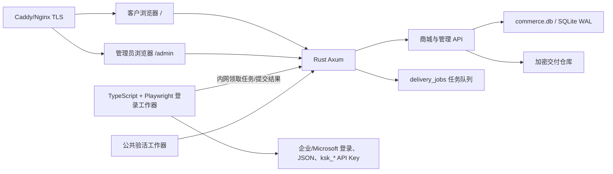

# Kiro 账号商城、客户前端与销售管理端规划草案

> 版本：v0.2 · 日期：2026-07-17 · 状态：已按“购买后按需自动登录提取”修订，等待评审

## 1. 目标

在现有 `kiro.rs` 项目中增加一个可部署到单台服务器的数字账号商城：

- 客户登录后浏览可售账号，按公开编号、地区、账号类型和交付能力筛选并批量选号。
- 客户把多个账号加入购物车，使用后台分配的账户余额一次性购买。
- 购买时原子扣减余额、锁定库存并生成不可变订单，避免同一账号被两人买走。
- 管理员只负责在网页管理端录入原始账号、一次性密码、Start URL、地区和账号类型，不依赖本地 Python 工具准备 JSON/API Key。
- 客户购买后进入订单提取页，点击“提取账号资料”“提取 JSON”或“提取 API Key”；服务器才启动自动登录、必要的密码重置、凭据获取和 API Key 创建。
- 自动化结果由服务器加密保存，后续再次提取直接返回已保存结果，不重复登录或重复创建 Key。
- 管理员可导入库存、设置价格、批量上下架、维护客户余额、处理提取失败、订单与退款、查看审计记录。
- 管理员可指定一组“公共验活账号”，前端公开展示各地区/类型的实时可用状态和最后检测时间，但不泄露账号信息。
- 现有 Python 自动登录代码只作为协议、状态机和抓包行为参考；生产链路不依赖本地 Python GUI。

## 2. 本期边界

### 2.1 MVP 包含

- 管理员创建客户、重置密码、启停客户。
- 管理员手工充值或扣减客户余额，每次调整必须填写原因。
- 客户商城、准确选号、批量购物车、余额结算、订单历史。
- 管理端只录入原始账号材料，支持定价、上下架和销售状态管理。
- 购买后按需启动服务器自动登录任务，生成文本、合并 JSON、单账号 JSON、API Key 清单和 ZIP 交付包。
- 客户可查看任务进度、阶段日志、安全失败原因，并在失败时进入售后处理。
- 公共状态页和专用验活账号调度。
- 单机 Docker 部署、HTTPS、SQLite WAL、备份、日志和监控。

### 2.2 MVP 不包含

- 微信、支付宝、Stripe 等自动支付；第一版余额由管理员维护。
- 开放注册、短信、邮件验证码、优惠券、代理商和多商户结算。
- 多服务器水平扩容、Redis、消息队列或 PostgreSQL 集群。
- 客户之间转账或余额提现。

这些能力以后可以增加，但不应进入第一版交易核心，以免延迟上线并扩大资金风险。

## 3. 已确认的项目现状

- 服务端：Rust + Axum，已有 `/api/admin`、凭据管理、单凭据测试、余额查询和 SQLite WAL 使用经验。
- 管理端：React 19 + Vite + Tailwind + TanStack Query，构建后嵌入 Rust 二进制并从 `/admin` 提供。
- 部署：现有 Docker 多阶段构建，服务监听 8990，数据目录挂载到 `/app/config`。
- 账号自动化：现有 Python 批量登录工具已验证企业账号登录、一次性密码重置、JSON 获取和失败分类，可作为生产自动化引擎的行为参考。
- API Key：当前未提交代码已验证 `ksk_*` 创建流程；`rawKey` 只在创建时返回一次，因此服务器创建成功后必须先加密持久化，再把成功结果返回客户。

本规划只新增一份文档，不修改或提交上述在途代码。

## 4. 架构方案比较

| 方案 | 结构 | 优点 | 缺点 | 结论 |
|---|---|---|---|---|
| A. Rust 交易主服务 + TypeScript 登录工作器 | Rust/Axum 负责用户、余额、库存、订单和秘密仓库；独立 TypeScript/Playwright 工作器负责自动登录、密码重置、JSON 与 API Key | 交易核心复用现有 Rust；Playwright 适合企业/Microsoft 浏览器流程；工作器可独立重启和限流 | 比单容器多一个内部服务，需要任务租约和内部鉴权 | **推荐** |
| B. 全部用 Rust | Rust 同时负责交易和 Chromium/CDP 自动化 | 单语言、单二进制 | Rust 浏览器自动化生态与调试体验弱于 Playwright，门户变化后的维护成本高 | 不推荐第一版 |
| C. 全部用 TypeScript 重写商城后端 | Node/TypeScript 负责交易、页面和登录 | 前后端语言统一，自动化方便 | 重写现有 Rust 鉴权、凭据与部署能力；交易迁移范围过大 | 不采用 |

### 4.1 推荐架构

采用方案 A。Rust 是唯一对公网提供 API、持有数据库和加密主密钥的主服务；TypeScript 工作器只通过 Docker 内网领取授权后的单次任务，运行 Playwright/HTTP 自动化，并把结果提交回 Rust。工作器不直接打开 `commerce.db`，也不长期保存客户秘密。

TypeScript 工作器参考现有 Python 的协议、字段、错误码和登录阶段，但重新实现为服务器任务，不继续维护 Python GUI 集成。企业登录优先移植已验证的状态机；凡是依赖浏览器 TLS/指纹的步骤必须由真实 Playwright Chromium 执行，不能用普通 Node `fetch` 冒充浏览器。只有已经验证与指纹无关的协议接口才允许直接 HTTP 调用。Microsoft 登录统一使用隔离的 Playwright Chromium 上下文。



## 5. 核心业务规则

### 5.1 客户看到什么

购买前只展示：

- 公开编号，例如 `US-E-00241`，不展示真实登录名。
- 地区、账号类型、价格、最近验活状态、最后验活时间。
- 可提取能力徽章：账号资料、JSON、API Key；购买前不声称这些材料已经生成。
- 商品说明和售后规则。

真实账号、一次性密码、URL、JSON、Token 和 API Key 只有订单所有者购买成功后才能进入提取流程。为避免客户先手工消耗一次性密码，默认不直接展示初始密码；首次点击任一提取按钮会先完成统一的账号开通流程，成功后再展示服务器保存的最新密码。

### 5.2 库存状态

```text
DRAFT -> READY -> LISTED -> RESERVED -> SOLD
       \-> QUARANTINED
LISTED/READY -> DISABLED
```

- `DRAFT`：刚导入，不能出售。
- `READY`：账号、一次性密码、URL、地区等原始字段通过格式检查，等待定价或上架；此时不要求已经登录。
- `LISTED`：客户可见可购买。
- `RESERVED`：结算事务中的短暂状态，不允许长期占用。
- `SOLD`：已购买，后续自动登录和交付状态由订单项管理，库存不能再次上架。
- `QUARANTINED`：原始材料缺失、重复账号或管理员判定不可售。
- `DISABLED`：管理员主动停售。

销售库存与 RS 日常调用凭据池分开。可售账号不能继续被 RS 消耗；专门测试存活的账号使用独立的验活池，并明确标记 `saleable=false`。

### 5.3 余额与账本

- 金额统一用整数最小单位 `amount_cents`，严禁浮点数。
- `users.balance_cents` 是快速余额快照，`wallet_entries` 是不可删除的真实账本。
- 管理员充值、管理员扣款、购买、退款都生成账本项，记录操作前后余额、操作者、原因和关联订单。
- 不允许直接编辑历史账本；修正只能新增一条反向记录。
- 后端拒绝负余额，前端显示只是提示，不能替代服务端校验。

### 5.4 原子购买与防超卖

购物车不预占库存。点击结算后：

1. 客户发送库存 ID 列表和 `Idempotency-Key`。
2. 服务端开启 SQLite `BEGIN IMMEDIATE` 事务。
3. 重新读取客户状态、余额、库存状态和当前价格。
4. 使用条件更新扣款：只有 `balance_cents >= total` 才成功。
5. 写入钱包扣款记录、订单、订单项和价格快照。
6. 把所有库存从 `LISTED` 更新为 `SOLD`；任何一条更新不到就整体回滚。
7. 把原始账号、一次性密码、URL、地区生成订单级加密“初始提取快照”，供后续工作器使用；JSON/API Key 此时尚未生成。
8. 提交事务并返回订单号。

重复提交同一个幂等键只能返回原订单，不能重复扣款。两个客户同时购买同一账号时，只允许一个事务成功，另一个返回 `409 inventory_changed` 并保留余额。

### 5.5 退款

- MVP 由管理员人工退款，必须填写原因。
- 退款产生正向账本项并关联原订单，不删除订单和原扣款。
- 退款后账号默认仍保持 `SOLD`，避免已泄露秘密被二次出售。
- 如果确需重新上架，必须先确认客户从未成功提取，再由管理员人工处理；只要秘密曾被展示或自动登录成功，就禁止重新销售。

## 6. 交付材料设计

每个订单项支持以下独立材料状态：`unrequested`、`queued`、`running`、`ready`、`failed`、`manual_required`。

| 材料 | 内容 | 交付方式 |
|---|---|---|
| 基础账号 | 自动登录完成后的账号、最新密码、Start URL、地区 | 页面查看、复制、TXT |
| RS JSON | 自动登录获得且与现有精简导出/批量导入兼容的完整凭据 | 单账号 JSON、合并 JSON |
| Kiro API Key | 使用登录后的 access token 按需创建完整 `ksk_*` | 页面复制、API Key TXT |
| 完整包 | 上述材料与订单清单 | ZIP 下载 |

推荐文本格式：

```text
account----password----start_url----region
```

交付规则：

- 所有导出均由服务端实时生成，响应设为 `Cache-Control: no-store`。
- 每次查看、复制和下载都写审计日志，但日志不记录秘密正文。
- JSON 必须通过现有 `CredentialRecord`/RS 导入契约测试，不能另造不兼容格式。
- 管理端上架只要求原始账号材料完整；JSON/API Key 在客户购买后由按钮触发。
- 同一订单项的多个提取按钮共享一个“基础登录任务”。如果 JSON 与 API Key 同时被点击，只允许一次登录和一次密码重置，后续步骤复用已保存 access token/凭据。
- 登录成功后必须先把最新密码、Token、JSON 加密写入 Rust 主服务，再把任务标记成功；浏览器工作器本地临时目录随后销毁。
- 创建 API Key 成功后必须先加密保存完整 `rawKey`，再返回 `ready`；后续提取直接返回已保存 Key，不重复创建。
- 如果门户已有同名 Key 但服务器没有完整 rawKey，不能把 keyPrefix 当作交付结果，必须创建一把新的 Key。
- 提取接口是异步任务：点击后立即返回 job ID，前端通过轮询或 SSE 显示阶段、进度和安全错误码，不能让 HTTP 请求一直等待浏览器流程结束。

### 6.1 统一自动开通流程

```text
UNREQUESTED
  -> QUEUED
  -> LOGIN_STARTING
  -> USERNAME_SUBMITTED
  -> ONE_TIME_PASSWORD_SUBMITTED
  -> PASSWORD_RESETTING（仅需要时）
  -> CREDENTIAL_SAVING
  -> BASE_READY
  -> JSON_READY
  -> API_KEY_CREATING（客户请求时）
  -> API_KEY_READY
```

- 第一次提取无论选择“账号资料”“JSON”还是“API Key”，都先执行到 `BASE_READY/JSON_READY`。
- API Key 提取依赖 JSON 登录结果，但 JSON 提取不强制创建 API Key。
- 已完成阶段可幂等复用；刷新页面、重复点击和工作器重启不会重新消耗一次性密码。
- 每个订单项同时最多有一个活跃基础登录任务；数据库唯一约束和任务租约共同保证。
- 新密码必须由 Rust 主服务生成并加密保存为 `pending_password`，工作器确认门户修改成功后再原子提升为 `current_password`；这样即使进程中断也能恢复和审计。

### 6.2 失败与售后

- `invalid_password`、`account_disabled` 等确定错误标记为 `failed`，停止自动重试。
- 网络超时、429、临时 5xx 采用有限重试和指数退避，不能无限重复登录。
- MFA、验证码或门户未知页面标记 `manual_required`，进入管理端人工处理队列。
- 客户看到安全错误说明和“联系管理员/申请处理”按钮，不看到内部响应、Token 或堆栈。
- 管理员可选择重试、补充/修正原始密码、人工完成交付、替换同等库存或退款。
- 自动登录尚未成功且未展示任何秘密时，可以换货；一旦最新密码、JSON 或 API Key 被客户查看，默认只允许人工售后，不能把原账号重新销售。

## 7. 专用验活系统

### 7.1 验活池

- 管理员创建验活池，例如“美国企业账号”“欧洲 API Key”。
- 每个池选择 1–5 个专用账号，这些账号永不出售。
- 后台任务按配置周期轮询，例如 5 分钟；单轮设置并发、超时和退避。
- 复用现有凭据测试服务，不通过公网 Admin HTTP 自己调用自己。

### 7.2 状态判定

- `healthy`：最近连续成功，响应和模型能力正常。
- `degraded`：部分失败、延迟过高或仅部分探针成功。
- `down`：连续失败达到阈值。
- `unknown`：从未检测或结果过期。

前端只公开池名称、地区、状态、成功率、延迟区间和最后检测时间；不公开账号编号、登录名、错误正文、Token 或 API Key。

公共状态不是每个待售账号的逐个保证。商品详情明确说明“状态来自同类型专用测试账号；具体账号会在购买后的自动提取流程中验证，失败时进入售后处理”。

## 8. 客户前端规划

新增独立 `storefront-ui/`，继续使用 React、Vite、Tailwind、TanStack Query、Radix 和 Lucide。客户站点部署到 `/`，管理端保持 `/admin`。

### 8.1 页面

1. **登录页**：账号密码登录，显示服务状态与售后说明。
2. **商城/选号页**：地区、类型、价格、材料、验活状态筛选；支持单选、Ctrl/Shift 多选和批量加入购物车。
3. **购物车**：显示公开编号、单价、总价、当前余额和结算后余额；库存变化时明确标出失效项。
4. **结算确认**：二次确认数量、金额和交付规则；提交期间禁止重复点击并使用幂等键。
5. **我的订单**：订单号、金额、数量、时间和交付状态。
6. **订单详情/提取页**：每个账号提供“提取账号资料”“提取 JSON”“提取 API Key”按钮；显示排队、登录、重置密码、保存凭据、创建 Key 等阶段；完成后支持查看、复制和下载。
7. **公共状态页**：展示各验活池状态和更新时间。
8. **账户页**：余额、账本记录、修改密码、退出全部会话。

### 8.2 交互与视觉

- 定位为“可信的数字商品与余额系统”，使用高对比度的深海军蓝、信任蓝、白/浅灰和成功绿；不使用花哨赌场式视觉。
- 桌面端数据密度适中，移动端使用可勾选卡片；购物车始终显示数量与总价。
- 不能只靠颜色表达存活或订单状态，必须同时显示文字和图标。
- 动态余额、库存变化、结算结果使用 `aria-live`；对话框正确管理焦点。
- 所有表单有可见标签，键盘可完成筛选、选择、加入购物车和结算。
- 支持 320、768、1024、1440 像素宽度；避免横向溢出。
- 交互动效控制在 150–250ms，并遵循 `prefers-reduced-motion`。

## 9. 管理端规划

在现有 `admin-ui` 增加“销售中心”分区，不重写已有凭据管理。

### 9.1 页面

1. **销售概览**：今日订单、销售额、可售库存、隔离库存、客户余额总额、验活状态。
2. **库存管理**：直接录入或批量粘贴账号、一次性密码、URL、地区；字段预览、去重、批量定价、上下架、隔离和销售状态。
3. **商品/价格模板**：按地区和账号类型设置默认价格、交付材料要求和公开说明。
4. **客户与余额**：创建客户、启停、重置密码、充值/扣款、查看账本。
5. **订单管理**：订单详情、自动登录任务进度、安全阶段日志、重试/修正密码、人工交付、换货、退款和异常备注。
6. **验活池**：设置专用账号、周期、超时、失败阈值和公开名称。
7. **审计日志**：管理员操作、客户下载、余额变化、库存状态变化和登录事件。
8. **销售设置**：商城开关、会话策略、导出策略、库存预检时效、备份状态。

### 9.2 账号导入

账号只从网页管理端录入，不依赖本地 Python 软件。支持：

- 表单单条添加：账号、一次性密码、Start URL、地区、账号类型、价格模板。
- 文本批量粘贴：继续兼容 `login = ... / onetime password = ...` 和 `account|password|url` 等格式，并允许管理员统一指定 URL/地区。
- CSV/JSON 批量上传仅作为原始账号字段载体，不接受提前生成的 refreshToken、完整 JSON 或 API Key 作为上架必填项。

提交使用导入批次 ID 与单条幂等键；Rust 服务加密账号和密码成功后才返回保存成功。任何日志、错误和预览都不得输出完整密码。

## 10. 数据模型

建议新增独立 `commerce.db`，主要表如下：

| 表 | 关键字段 | 说明 |
|---|---|---|
| `store_users` | id, username, password_hash, status, balance_cents, version | 客户与余额快照 |
| `store_sessions` | id_hash, user_id, expires_at, revoked_at | HttpOnly 会话，只存令牌哈希 |
| `wallet_entries` | user_id, amount_cents, before, after, kind, order_id, operator, reason | 不可变钱包账本 |
| `catalog_products` | name, region, account_type, default_price_cents, extract_capabilities, published | 商品/价格模板与可提取能力 |
| `inventory_items` | public_code, product_id, status, price_cents, encrypted_initial_account, version | 原始账号、一次性密码、URL、地区的加密库存 |
| `carts` / `cart_items` | user_id, inventory_id, created_at | 服务端购物车；不预占库存 |
| `orders` | order_no, user_id, status, total_cents, idempotency_key, created_at | 订单主表 |
| `order_items` | order_id, inventory_id, public_code, unit_price_cents, delivery_state, secret_version | 购买快照与提取总状态 |
| `delivery_jobs` | order_item_id, kind, status, stage, lease_owner, lease_until, attempts, safe_code | 自动登录/JSON/API Key 异步任务与租约 |
| `delivery_artifacts` | order_item_id, kind, encrypted_payload, version, created_at | 最新密码、JSON、API Key 等加密结果 |
| `delivery_secret_versions` | order_item_id, kind, encrypted_payload, state, created_at | pending/current 密码和交付秘密版本历史 |
| `probe_pools` | public_name, region, interval, thresholds, published | 公共验活池配置 |
| `probe_accounts` | pool_id, credential_ref, enabled | 专用测试账号，不可售 |
| `probe_results` | pool_id, state, latency_ms, checked_at, safe_code | 公共状态来源 |
| `store_audit_logs` | actor_type, actor_id, action, target, safe_meta, created_at | 不含秘密的审计日志 |
| `store_outbox` | event_type, payload, attempts, next_run_at | 任务通知、售后告警等事务后事件 |

数据库开启 WAL、foreign keys、busy timeout 和版本化迁移。交易写操作由单独的阻塞线程池执行，避免 `rusqlite` 阻塞 Axum 异步运行时。

## 11. API 规划

### 11.1 客户 API：`/api/store`

```text
POST   /auth/login
POST   /auth/logout
GET    /auth/me
PUT    /auth/password
GET    /catalog
GET    /catalog/{public_code}
GET    /cart
POST   /cart/items
DELETE /cart/items/{inventory_id}
POST   /checkout
GET    /orders
GET    /orders/{order_no}
POST   /orders/{order_no}/items/{item_id}/extract-account
POST   /orders/{order_no}/items/{item_id}/extract-json
POST   /orders/{order_no}/items/{item_id}/extract-apikey
GET    /delivery-jobs/{job_id}
GET    /delivery-jobs/{job_id}/events
GET    /orders/{order_no}/items/{item_id}/artifacts
GET    /orders/{order_no}/export?format=text|json|apikey|bundle
GET    /wallet/entries
GET    /status
```

### 11.2 销售管理 API：`/api/admin/store`

```text
GET/POST       /users
PUT            /users/{id}
POST           /users/{id}/reset-password
POST           /users/{id}/wallet-adjustments
GET            /users/{id}/wallet-entries
GET/POST       /products
PUT            /products/{id}
GET            /inventory
POST           /inventory/import/preview
POST           /inventory/import/commit
POST           /inventory/batch-price
POST           /inventory/batch-publish
GET             /orders
GET             /orders/{order_no}
GET             /delivery-jobs
POST            /delivery-jobs/{job_id}/retry
POST            /delivery-jobs/{job_id}/repair-input
POST            /orders/{order_no}/items/{item_id}/replace
POST            /orders/{order_no}/items/{item_id}/manual-complete
POST            /orders/{order_no}/refund
GET/POST         /probe-pools
PUT              /probe-pools/{id}
POST             /probe-pools/{id}/run
GET              /audit-logs
GET/PUT           /settings
```

### 11.3 内部工作器 API：`/internal/login-worker`

```text
POST   /lease-next
POST   /jobs/{job_id}/heartbeat
POST   /jobs/{job_id}/events
POST   /jobs/{job_id}/complete
POST   /jobs/{job_id}/fail
```

- 路由只监听 Docker 内网，不通过公网反向代理暴露，并使用内部 mTLS 加密连接。
- 每次租约返回短期任务令牌和最小必需的加密任务包；工作器退出后不保留秘密。
- 工作器使用客户端证书 + `WORKER_SHARED_SECRET` 双重认证，并校验时间戳、nonce 和请求体摘要防重放。
- `complete` 接口在一个 Rust 数据库事务中保存加密结果、更新阶段并释放租约。

错误响应统一含稳定 `code`、用户可读 `message` 和 `requestId`，不返回内部异常或秘密。余额不足返回 `409 insufficient_balance`，库存变化返回 `409 inventory_changed`，幂等冲突返回原订单或明确冲突结果。

## 12. 认证、加密与安全

- 客户密码使用 Argon2id；禁止明文密码和可逆密码存储。
- 客户使用短期 HttpOnly、Secure、SameSite=Lax 会话 Cookie；登录后轮换会话 ID，支持主动注销全部会话。
- 状态修改接口启用 CSRF 防护、Origin 校验和速率限制。
- 管理员继续用现有 `adminApiKey` 完成初始认证，但销售模块推荐换取短期 HttpOnly 管理会话，避免长期 Key 在浏览器每个请求中暴露。
- 账号、一次性密码、最新密码、JSON、Token、API Key 和交付快照使用 AEAD 加密；主密钥来自 `STORE_MASTER_KEY` 环境变量，不写入数据库、镜像或仓库。
- 数据库只保存会话令牌哈希和幂等键哈希。
- 列表接口永不返回加密载荷；交付接口按订单所有权单独解密。
- 服务端日志、审计日志、错误快照和监控标签禁止记录请求体、Cookie、Authorization、密码、Token 或 API Key。
- 管理端高风险操作支持二次确认；余额调整、退款、重新上架必须填写理由。
- TypeScript 工作器每个任务创建全新无痕 Chromium 上下文和临时目录，禁止复用 Cookie、localStorage 或浏览器 profile；任务结束无论成功失败都清理。
- Rust 主服务持有加密主密钥；工作器只拿单次任务所需秘密，结果回传后立即清空内存引用和临时文件。
- 上线前确认账号销售、API Key 转让和自动化登录符合上游服务条款及当地法规。

## 13. 服务器自动登录引擎

### 13.1 技术选择

- **主后端：Rust/Axum**，负责交易、权限、任务状态、加密存储和对外 API。
- **登录工作器：TypeScript + Node.js + Playwright**，负责企业账号、Microsoft 账号、浏览器页面和按需 API Key 流程。
- Python 代码只作为测试过的参考实现，用来对照请求顺序、字段、密码重置规则和安全错误码；生产服务不调用 Python 脚本，也不依赖本地 GUI。

### 13.2 企业账号流程

1. 领取任务并创建隔离上下文。
2. 注册/确认 OIDC 设备授权，进入企业门户。
3. 提交用户名和一次性密码。
4. 如果门户要求重置密码，使用 Rust 预生成并加密保存的 pending password。
5. 获取 SSO/access token，构造兼容 RS 的 JSON。
6. 把最新密码、JSON 和必要 Token 提交给 Rust 加密保存。
7. 客户请求 API Key 时，复用保存的 access token/profileArn 调用 CreateApiKey，并在收到 rawKey 后立即提交保存。

### 13.3 Microsoft 账号流程

1. 使用独立 Chromium 上下文打开授权页。
2. 自动填写账号、密码并处理常见确认页。
3. 遇到 MFA、验证码、异常安全页时停止并标记 `manual_required`，不尝试绕过安全验证。
4. 获取回调 code/token 后生成 RS JSON并提交保存。
5. API Key 创建复用与企业流程相同的内部模块。

### 13.4 任务可靠性

- SQLite 中的 `delivery_jobs` 是唯一任务事实来源，不能只依赖内存队列。
- 工作器领取任务时写租约；定期 heartbeat。进程崩溃后租约过期，任务可在安全阶段恢复或转人工。
- 一次性密码提交后属于不可安全重复阶段。工作器崩溃时不能盲目从头重试，应根据已保存阶段和 pending password 判断恢复策略。
- JSON 与 API Key 任务按订单项串行，API Key 必须等待基础登录成功。
- 每个账号设置最大重试次数、总时限和同门户并发上限，防止批量客户同时点击导致风控。
- 工作器事件只发送阶段、耗时和安全 code，不发送输入框内容、页面 HTML、Token 或完整错误响应。

## 14. 部署方案

### 14.1 单服务器拓扑

```text
Internet
  -> Caddy/Nginx :443
      -> kiro-rs container :8990（仅内网/loopback）
          /                客户商城
          /admin           管理端
          /api/store       客户 API
          /api/admin/store 销售管理 API
          /v1              现有模型 API
      -> login-worker container（无公网端口）
          TypeScript + Node.js + Playwright Chromium
          仅访问 /internal/login-worker
      -> /app/config/commerce.db
      -> /app/config/commerce-backups/
```

### 14.2 构建与配置

- Dockerfile 增加 `storefront-ui` 构建阶段，Rust 二进制分别嵌入客户站和管理站资源。
- 新增独立 `login-worker` 镜像，固定 Node.js/Playwright/Chromium 版本；浏览器升级先在测试环境跑企业和 Microsoft 契约再发布。
- 宿主机只公开 80/443，8990 不直接暴露公网。
- 必需秘密/配置：`STORE_MASTER_KEY`、`STORE_SESSION_KEY`、`WORKER_SHARED_SECRET`、工作器 mTLS 证书、`PUBLIC_BASE_URL`。
- 生产配置启用 HSTS、安全响应头、请求体上限、登录限流和可信代理配置。
- `/health/live` 只表示进程存活；`/health/ready` 检查数据库迁移和关键后台任务。

### 14.3 备份与恢复

- 每日使用 SQLite Online Backup/VACUUM INTO 生成一致备份，不直接复制正在写入的 DB 文件。
- 备份加密后保留本机多版本，并同步到另一台机器或对象存储。
- 交付加密主密钥与数据库备份分开保存；缺任一方都不能恢复秘密。
- 上线前和每月执行一次恢复演练，验证订单、余额、库存和交付快照可恢复。

## 15. 实施阶段

### 阶段 0：契约与原型冻结

- 确认本文件的默认业务规则。
- 固定管理端原始账号输入、自动登录阶段、精简 JSON、API Key 和基础文本交付契约。
- 产出客户选号、购物车、订单提取、库存、客户余额五个低保真页面原型。
- 写数据库迁移和 API 契约测试骨架。

**完成标准：** 页面范围、字段、错误码和交易规则均可测试，不存在“实现时再决定”的核心规则。

### 阶段 1：交易核心与安全基础

- 建立 `commerce` Rust 模块、SQLite 迁移、加密仓库、客户认证和管理会话。
- 实现钱包账本、库存状态机、原子购买、幂等和审计日志。
- 完成并发购买、重复请求、余额不足和事务回滚测试。

**完成标准：** 两个并发客户争抢一个库存时恰好一人成功；任何失败都不多扣余额、不重复交付。

### 阶段 2：服务器自动登录工作器

- 建立 `login-worker` TypeScript 项目、内部认证、任务租约、阶段事件和 Chromium 隔离运行器。
- 参考现有 Python 企业登录流程，逐阶段移植并建立录制响应契约；实现 Microsoft Playwright 流程。
- 实现 pending/current 密码两阶段保存、JSON 生成和 API Key 按需创建。
- 完成错误分类、有限重试、崩溃恢复、并发限制和临时文件清理测试。

**完成标准：** 管理端只录入一个测试账号后，购买者点击按钮能由服务器完成登录并拿到兼容 JSON；重复点击不会重复改密码或创建 Key。

### 阶段 3：销售管理端

- 增加销售概览、库存、客户余额、订单、验活池和审计页面。
- 实现导入预览/提交、批量定价、批量上下架和人工退款。
- 实现原始账号单条添加、文本批量粘贴、统一 URL/地区和去重预览。
- 增加自动登录任务队列、阶段日志、修正输入、重试、人工交付、换货和退款操作。

**完成标准：** 管理员只需添加原始账号材料即可上架，并能完整追踪客户购买后的每个自动登录任务。

### 阶段 4：客户商城与购物车

- 新建 `storefront-ui`，实现登录、筛选、批量选号、购物车和结算。
- 实现订单列表、余额账本和库存变化提示。
- 完成桌面、移动端、键盘操作和无障碍检查。

**完成标准：** 客户可在不看到秘密的情况下批量选号，并用余额稳定完成一次购买。

### 阶段 5：按需提取与多格式交付

- 实现“提取账号资料/JSON/API Key”按钮、任务轮询/SSE、阶段进度、页面遮罩查看、复制、TXT、单/合并 JSON、API Key 清单和 ZIP。
- 完成订单所有权、下载审计、no-store 缓存和 JSON 兼容测试。

**完成标准：** 非订单所有者无法获取任何交付字段；购买者导出的 JSON 可直接导回 RS。

### 阶段 6：验活与售后闭环

- 实现专用验活池调度、状态聚合和公共状态页。
- 实现专用测试账号的服务器自动验活、状态过期处理和公共状态说明。
- 实现提取失败重试、修正密码、人工处理、换货、退款和受控回收流程。

**完成标准：** 公共状态无秘密泄露；提取失败有明确售后闭环；已展示秘密的账号绝不重新销售。

### 阶段 7：生产部署与加固

- 更新 Docker 构建、反向代理、HTTPS、安全头、限流和运行手册。
- 实施一致备份、恢复演练、告警、审计保留和密钥轮换流程。
- 完成端到端验收与小批量灰度。

**完成标准：** 新服务器从空目录可按文档部署，备份可恢复，关键错误可监控，灰度订单完成后再开放全部库存。

## 16. 测试与验收清单

### 16.1 服务端

- 数据库迁移可重复运行，旧版本升级不丢数据。
- 两用户并发买同一账号、防重复扣款和幂等重放测试。
- 管理员充值/扣款/退款后的余额快照与账本总和一致。
- 每种库存状态转换的允许/拒绝测试。
- 同一订单项并发点击 JSON/API Key 时只创建一个基础登录任务。
- 一次性密码提交前、提交后、密码重置后分别模拟工作器崩溃，验证恢复策略不会重复消耗密码。
- API Key 创建成功但客户端断线时，rawKey 已先加密保存，重试提取不会再创建新 Key。
- 工作器租约、heartbeat、超时回收、有限重试和门户并发限制测试。
- 客户越权读取他人订单、导出和钱包记录返回 403/404。
- 日志和 API 响应敏感信息扫描。
- 主密钥错误、数据库忙、磁盘满和后台任务重试测试。

### 16.2 前端

- React 单元测试覆盖金额、选择、购物车、错误映射和敏感字段遮罩。
- Playwright 覆盖登录、批量选号、结算、余额不足、库存冲突、订单提取和管理员退款。
- Playwright 覆盖提取任务阶段、刷新页面恢复进度、失败售后入口和敏感字段最终展示。
- 320/768/1024/1440 响应式截图检查。
- 键盘导航、焦点、ARIA live、颜色对比和 reduced-motion 检查。

### 16.3 部署

- Rust 与登录工作器 Docker 冷启动、迁移、重启、工作器崩溃恢复、滚动升级和回滚。
- HTTPS、Cookie、安全头、请求体限制和登录限流。
- 在线备份与全新环境恢复。
- 真实账号只做小批灰度，测试数据与生产库存完全隔离。

## 17. 风险与控制

| 风险 | 控制措施 |
|---|---|
| 同一账号超卖 | SQLite 写事务、条件更新、唯一约束、幂等键 |
| 重复扣款 | 订单幂等键、不可变钱包账本、事务内扣款 |
| 秘密泄露 | AEAD 加密、订单所有权、no-store、日志白名单、下载审计 |
| API Key 无法找回 | 创建结果先加密保存再返回；缺失 rawKey 时创建新 Key，不交付 keyPrefix |
| 一次性密码被重复消耗 | 单活跃任务、阶段持久化、pending/current 密码两阶段提交、崩溃后禁止盲目从头重试 |
| 客户先手工使用初始密码 | 默认不直接展示一次性密码，先由服务器完成统一自动开通 |
| 浏览器工作器泄露会话 | 每任务无痕上下文、临时目录销毁、无公网端口、最小任务秘密 |
| 门户页面变化 | 阶段化选择器、契约录制、浏览器版本锁定、manual_required 人工兜底 |
| 存活状态误导客户 | 只展示专用验活池并说明不是逐库存保证；提取失败提供售后 |
| SQLite 锁竞争 | WAL、busy timeout、短事务、阻塞线程池；达到容量阈值后迁移 PostgreSQL |
| 管理 Key 被浏览器窃取 | HTTPS、CSP、短期 HttpOnly 管理会话、限制长期 Key 暴露 |
| 退款后再次泄露 | 退款不自动重新上架；重新上架必须轮换全部秘密 |

## 18. 评审默认决策

为了让后续实施不反复停下来询问，当前计划默认采用以下规则：

1. 第一版不接第三方支付，客户余额由管理员手工调整。
2. 客户购买前看到公开编号，不看到真实登录名。
3. 客户可以准确选择单个库存，也可以批量选择加入购物车。
4. 购物车不锁库存，以结算事务结果为准。
5. 专用验活账号不可售，前端只展示池级状态；普通库存不在上架前消耗一次性密码。
6. 购买后第一次点击提取按钮才启动服务器自动登录；成功结果可重复下载并记录审计。
7. 退款不自动重新上架账号。
8. 第一版部署为单实例 Rust + SQLite WAL；保留迁移 PostgreSQL 的仓储边界。
9. 客户站使用独立 React 应用，管理端在现有 React Admin 中扩展。
10. 商城库存不依赖本地 Python GUI；Rust 负责交易，TypeScript/Playwright 工作器负责自动登录。
11. 初始一次性密码默认不直接展示，服务器成功重置后向客户交付最新密码。
12. JSON 与 API Key 按需生成；同一账号的并发提取共享一个基础登录任务。

如果评审没有提出修改，后续实施计划就以这十二条为固定前提。

## 19. 推荐的下一步

先评审本文件，重点确认第 2、5、6、13 和 18 节。确认后再拆成七份可独立验收的实施计划：

1. 交易数据库、认证与安全基础。
2. TypeScript/Playwright 自动登录工作器与内部任务协议。
3. 管理端原始账号添加、库存与售后任务管理。
4. 客户商城、购物车与结算。
5. 按需 JSON/API Key 提取与多格式交付。
6. 专用验活池与售后闭环。
7. 双容器 Docker 生产部署、备份与运维。

每份实施计划采用测试先行和独立本地提交，不上传 GitHub，直到你明确要求部署或推送。
