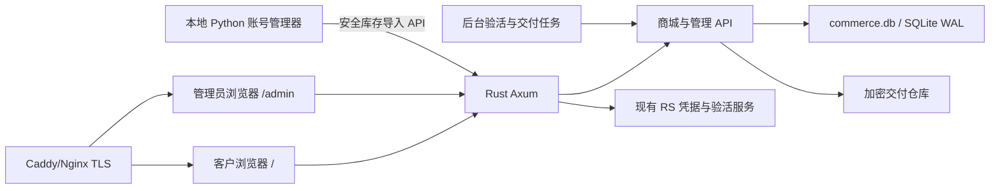

# Kiro 账号商城、客户前端与销售管理端规划草案

> 版本：v0.1 · 日期：2026-07-17 · 状态：等待评审，不进入编码

## 1. 目标

在现有 `kiro.rs` 项目中增加一个可部署到单台服务器的数字账号商城：

- 客户登录后浏览可售账号，按公开编号、地区、账号类型和交付能力筛选并批量选号。
- 客户把多个账号加入购物车，使用后台分配的账户余额一次性购买。
- 购买时原子扣减余额、锁定库存并生成不可变订单，避免同一账号被两人买走。
- 购买后客户可查看或导出账号、当前密码、Start URL、地区、兼容 JSON 和 Kiro API Key。
- 管理员可导入库存、设置价格、批量上下架、维护客户余额、处理订单与退款、查看审计记录。
- 管理员可指定一组“公共验活账号”，前端公开展示各地区/类型的实时可用状态和最后检测时间，但不泄露账号信息。
- 复用现有 Rust/Axum 服务、React 管理端、账号测试能力，以及正在开发的 `kiro_api_key` 获取和导出链路。

## 2. 本期边界

### 2.1 MVP 包含

- 管理员创建客户、重置密码、启停客户。
- 管理员手工充值或扣减客户余额，每次调整必须填写原因。
- 客户商城、准确选号、批量购物车、余额结算、订单历史。
- 账号库存导入、定价、上下架、验活、销售状态管理。
- 文本、合并 JSON、单账号 JSON、API Key 清单和 ZIP 交付包。
- 公共状态页和专用验活账号调度。
- 单机 Docker 部署、HTTPS、SQLite WAL、备份、日志和监控。

### 2.2 MVP 不包含

- 微信、支付宝、Stripe 等自动支付；第一版余额由管理员维护。
- 开放注册、短信、邮件验证码、优惠券、代理商和多商户结算。
- 多服务器水平扩容、Redis、消息队列或 PostgreSQL 集群。
- 客户之间转账或余额提现。

这些能力以后可以增加，但不应进入第一版交易核心，以免延迟上线并扩大资金风险。

## 3. 已确认的项目现状

- 服务端：Rust + Axum，已有 `/api/admin`、凭据管理、单凭据测试、余额查询和 SQLite WAL 使用经验。
- 管理端：React 19 + Vite + Tailwind + TanStack Query，构建后嵌入 Rust 二进制并从 `/admin` 提供。
- 部署：现有 Docker 多阶段构建，服务监听 8990，数据目录挂载到 `/app/config`。
- 账号自动化：Python 批量登录工具已经管理账号、密码、URL、地区、JSON，并可把凭据导入 RS。
- API Key：当前未提交代码正在增加 `CredentialRecord.kiro_api_key`、`ApiKeyClient` 和 `ApiKeyExporter`；`rawKey` 只在创建时返回一次，因此商城必须在入库时立即加密保存，不能等购买后再尝试找回。

本规划只新增一份文档，不修改或提交上述在途代码。

## 4. 架构方案比较

| 方案 | 结构 | 优点 | 缺点 | 结论 |
|---|---|---|---|---|
| A. 扩展现有 Rust 单体 | Rust/Axum 增加商城模块；SQLite WAL；现有管理端增加销售中心；新增独立客户 React 应用 | 复用凭据、验活、Docker 和管理能力；部署简单；秘密不跨服务传输 | 单体代码需要清晰模块边界；SQLite 适合单机而非大规模多实例 | **推荐** |
| B. 独立商城服务 | 新建商城后端 + PostgreSQL，与 RS 通过内部 API 同步 | 交易与代理服务完全隔离；未来扩展更容易 | 两套鉴权、部署和监控；同步失败复杂；交付秘密跨服务 | 第二阶段再考虑 |
| C. 前端 + Serverless | 商城部署到托管平台，交易调用云函数 | 原型快 | 秘密管理、原子扣款、长任务验活和数据归属不适合当前项目 | 不采用 |

### 4.1 推荐架构

采用方案 A，但商城数据访问必须通过独立模块和仓储接口，不能直接散落在现有凭据管理代码中。SQLite 表和服务接口保持数据库中立，为未来迁移 PostgreSQL 留出边界。



## 5. 核心业务规则

### 5.1 客户看到什么

购买前只展示：

- 公开编号，例如 `US-E-00241`，不展示真实登录名。
- 地区、账号类型、价格、最近验活状态、最后验活时间。
- 可交付能力徽章：账号密码、JSON、API Key。
- 商品说明和售后规则。

真实账号、密码、URL、JSON、Token 和 API Key 只有订单所有者购买成功后才能查看。

### 5.2 库存状态

```text
DRAFT -> VALIDATING -> READY -> LISTED -> RESERVED -> SOLD
                    \-> QUARANTINED
LISTED/READY -> DISABLED
```

- `DRAFT`：刚导入，不能出售。
- `VALIDATING`：检查字段、登录凭据、JSON 和 API Key。
- `READY`：交付材料完整，等待定价或上架。
- `LISTED`：客户可见可购买。
- `RESERVED`：结算事务中的短暂状态，不允许长期占用。
- `SOLD`：已交付，不能再次上架，除非管理员走带审计的回收流程。
- `QUARANTINED`：验活失败或交付材料不完整。
- `DISABLED`：管理员主动停售。

销售库存与 RS 日常调用凭据池分开。可售账号不能继续被 RS 消耗；专门测试存活的账号使用独立的验活池，并明确标记 `saleable=false`。

### 5.3 余额与账本

- 金额统一用整数最小单位 `amount_cents`，严禁浮点数。
- `users.balance_cents` 是快速余额快照，`wallet_entries` 是不可删除的真实账本。
- 管理员充值、管理员扣款、购买、退款都生成账本项，记录操作前后余额、操作者、原因和关联订单。
- 不允许直接编辑历史账本；修正只能新增一条反向记录。
- 后端拒绝负余额，前端显示只是提示，不能替代服务端校验。

### 5.4 原子购买与防超卖

购物车不预占库存。点击结算后：

1. 客户发送库存 ID 列表和 `Idempotency-Key`。
2. 服务端开启 SQLite `BEGIN IMMEDIATE` 事务。
3. 重新读取客户状态、余额、库存状态和当前价格。
4. 使用条件更新扣款：只有 `balance_cents >= total` 才成功。
5. 写入钱包扣款记录、订单、订单项和价格快照。
6. 把所有库存从 `LISTED` 更新为 `SOLD`；任何一条更新不到就整体回滚。
7. 从库存秘密生成订单级加密交付快照，确保后续库存编辑不改变已购买内容。
8. 提交事务并返回订单号。

重复提交同一个幂等键只能返回原订单，不能重复扣款。两个客户同时购买同一账号时，只允许一个事务成功，另一个返回 `409 inventory_changed` 并保留余额。

### 5.5 退款

- MVP 由管理员人工退款，必须填写原因。
- 退款产生正向账本项并关联原订单，不删除订单和原扣款。
- 退款后账号默认仍保持 `SOLD`，避免已泄露秘密被二次出售。
- 如果确需重新上架，必须重新登录、重置密码、重新生成 JSON/API Key、验活并生成新库存版本。

## 6. 交付材料设计

每个库存项支持以下独立材料状态：`missing`、`ready`、`failed`。

| 材料 | 内容 | 交付方式 |
|---|---|---|
| 基础账号 | 账号、当前密码、Start URL、地区 | 页面查看、复制、TXT |
| RS JSON | 与现有精简导出/批量导入兼容的完整凭据 | 单账号 JSON、合并 JSON |
| Kiro API Key | 完整 `ksk_*`，创建后立即加密入库 | 页面复制、API Key TXT |
| 完整包 | 上述材料与订单清单 | ZIP 下载 |

推荐文本格式：

```text
account----password----start_url----region
```

交付规则：

- 所有导出均由服务端实时生成，响应设为 `Cache-Control: no-store`。
- 每次查看、复制和下载都写审计日志，但日志不记录秘密正文。
- JSON 必须通过现有 `CredentialRecord`/RS 导入契约测试，不能另造不兼容格式。
- 商品只有在管理员要求的材料全部 `ready` 后才能上架。
- API Key `rawKey` 丢失时不能依赖 List API 找回，库存应进入 `QUARANTINED` 或重新生成一把新 Key。

## 7. 专用验活系统

### 7.1 验活池

- 管理员创建验活池，例如“美国企业账号”“欧洲 API Key”。
- 每个池选择 1–5 个专用账号，这些账号永不出售。
- 后台任务按配置周期轮询，例如 5 分钟；单轮设置并发、超时和退避。
- 复用现有凭据测试服务，不通过公网 Admin HTTP 自己调用自己。

### 7.2 状态判定

- `healthy`：最近连续成功，响应和模型能力正常。
- `degraded`：部分失败、延迟过高或仅部分探针成功。
- `down`：连续失败达到阈值。
- `unknown`：从未检测或结果过期。

前端只公开池名称、地区、状态、成功率、延迟区间和最后检测时间；不公开账号编号、登录名、错误正文、Token 或 API Key。

公共状态不是售出账号的永久保证。商品详情应明确“状态来自专用测试池，购买前库存项仍会执行独立预检”。

## 8. 客户前端规划

新增独立 `storefront-ui/`，继续使用 React、Vite、Tailwind、TanStack Query、Radix 和 Lucide。客户站点部署到 `/`，管理端保持 `/admin`。

### 8.1 页面

1. **登录页**：账号密码登录，显示服务状态与售后说明。
2. **商城/选号页**：地区、类型、价格、材料、验活状态筛选；支持单选、Ctrl/Shift 多选和批量加入购物车。
3. **购物车**：显示公开编号、单价、总价、当前余额和结算后余额；库存变化时明确标出失效项。
4. **结算确认**：二次确认数量、金额和交付规则；提交期间禁止重复点击并使用幂等键。
5. **我的订单**：订单号、金额、数量、时间和交付状态。
6. **订单详情/提取页**：按材料查看、复制或下载；敏感字段默认遮罩，点击后再显示。
7. **公共状态页**：展示各验活池状态和更新时间。
8. **账户页**：余额、账本记录、修改密码、退出全部会话。

### 8.2 交互与视觉

- 定位为“可信的数字商品与余额系统”，使用高对比度的深海军蓝、信任蓝、白/浅灰和成功绿；不使用花哨赌场式视觉。
- 桌面端数据密度适中，移动端使用可勾选卡片；购物车始终显示数量与总价。
- 不能只靠颜色表达存活或订单状态，必须同时显示文字和图标。
- 动态余额、库存变化、结算结果使用 `aria-live`；对话框正确管理焦点。
- 所有表单有可见标签，键盘可完成筛选、选择、加入购物车和结算。
- 支持 320、768、1024、1440 像素宽度；避免横向溢出。
- 交互动效控制在 150–250ms，并遵循 `prefers-reduced-motion`。

## 9. 管理端规划

在现有 `admin-ui` 增加“销售中心”分区，不重写已有凭据管理。

### 9.1 页面

1. **销售概览**：今日订单、销售额、可售库存、隔离库存、客户余额总额、验活状态。
2. **库存管理**：导入、字段预览、验活、材料完整度、批量定价、上下架、隔离和销售状态。
3. **商品/价格模板**：按地区和账号类型设置默认价格、交付材料要求和公开说明。
4. **客户与余额**：创建客户、启停、重置密码、充值/扣款、查看账本。
5. **订单管理**：订单详情、交付审计、人工退款、异常备注。
6. **验活池**：设置专用账号、周期、超时、失败阈值和公开名称。
7. **审计日志**：管理员操作、客户下载、余额变化、库存状态变化和登录事件。
8. **销售设置**：商城开关、会话策略、导出策略、库存预检时效、备份状态。

### 9.2 账号导入

支持两条路径：

- 管理端上传现有精简 JSON/TXT，先预览再提交。
- 本地 Python 账号管理器调用安全接口批量上传：账号、最新密码、URL、地区、完整 JSON、API Key 和来源批次。

上传使用批次 ID 与单条幂等键；服务端加密成功后才返回保存成功。任何日志、错误和预览都不得输出完整密码、Token、JSON 或 API Key。

## 10. 数据模型

建议新增独立 `commerce.db`，主要表如下：

| 表 | 关键字段 | 说明 |
|---|---|---|
| `store_users` | id, username, password_hash, status, balance_cents, version | 客户与余额快照 |
| `store_sessions` | id_hash, user_id, expires_at, revoked_at | HttpOnly 会话，只存令牌哈希 |
| `wallet_entries` | user_id, amount_cents, before, after, kind, order_id, operator, reason | 不可变钱包账本 |
| `catalog_products` | name, region, account_type, default_price_cents, required_artifacts, published | 商品/价格模板 |
| `inventory_items` | public_code, product_id, status, price_cents, encrypted_payload, artifact_flags, version | 单账号库存与加密秘密 |
| `inventory_checks` | inventory_id, state, latency_ms, checked_at, safe_code | 上架前和库存验活历史 |
| `carts` / `cart_items` | user_id, inventory_id, created_at | 服务端购物车；不预占库存 |
| `orders` | order_no, user_id, status, total_cents, idempotency_key, created_at | 订单主表 |
| `order_items` | order_id, inventory_id, public_code, unit_price_cents, encrypted_delivery_snapshot | 购买时不可变交付快照 |
| `probe_pools` | public_name, region, interval, thresholds, published | 公共验活池配置 |
| `probe_accounts` | pool_id, credential_ref, enabled | 专用测试账号，不可售 |
| `probe_results` | pool_id, state, latency_ms, checked_at, safe_code | 公共状态来源 |
| `store_audit_logs` | actor_type, actor_id, action, target, safe_meta, created_at | 不含秘密的审计日志 |
| `store_outbox` | event_type, payload, attempts, next_run_at | 提交后异步禁用凭据、通知等任务 |

数据库开启 WAL、foreign keys、busy timeout 和版本化迁移。交易写操作由单独的阻塞线程池执行，避免 `rusqlite` 阻塞 Axum 异步运行时。

## 11. API 规划

### 11.1 客户 API：`/api/store`

```text
POST   /auth/login
POST   /auth/logout
GET    /auth/me
PUT    /auth/password
GET    /catalog
GET    /catalog/{public_code}
GET    /cart
POST   /cart/items
DELETE /cart/items/{inventory_id}
POST   /checkout
GET    /orders
GET    /orders/{order_no}
GET    /orders/{order_no}/delivery
GET    /orders/{order_no}/export?format=text|json|apikey|bundle
GET    /wallet/entries
GET    /status
```

### 11.2 销售管理 API：`/api/admin/store`

```text
GET/POST       /users
PUT            /users/{id}
POST           /users/{id}/reset-password
POST           /users/{id}/wallet-adjustments
GET            /users/{id}/wallet-entries
GET/POST       /products
PUT            /products/{id}
GET            /inventory
POST           /inventory/import/preview
POST           /inventory/import/commit
POST           /inventory/batch-price
POST           /inventory/batch-publish
POST           /inventory/{id}/verify
GET             /orders
GET             /orders/{order_no}
POST            /orders/{order_no}/refund
GET/POST         /probe-pools
PUT              /probe-pools/{id}
POST             /probe-pools/{id}/run
GET              /audit-logs
GET/PUT           /settings
```

错误响应统一含稳定 `code`、用户可读 `message` 和 `requestId`，不返回内部异常或秘密。余额不足返回 `409 insufficient_balance`，库存变化返回 `409 inventory_changed`，幂等冲突返回原订单或明确冲突结果。

## 12. 认证、加密与安全

- 客户密码使用 Argon2id；禁止明文密码和可逆密码存储。
- 客户使用短期 HttpOnly、Secure、SameSite=Lax 会话 Cookie；登录后轮换会话 ID，支持主动注销全部会话。
- 状态修改接口启用 CSRF 防护、Origin 校验和速率限制。
- 管理员继续用现有 `adminApiKey` 完成初始认证，但销售模块推荐换取短期 HttpOnly 管理会话，避免长期 Key 在浏览器每个请求中暴露。
- 账号、密码、JSON、Token、API Key 和交付快照使用 AEAD 加密；主密钥来自 `STORE_MASTER_KEY` 环境变量，不写入数据库、镜像或仓库。
- 数据库只保存会话令牌哈希和幂等键哈希。
- 列表接口永不返回加密载荷；交付接口按订单所有权单独解密。
- 服务端日志、审计日志、错误快照和监控标签禁止记录请求体、Cookie、Authorization、密码、Token 或 API Key。
- 管理端高风险操作支持二次确认；余额调整、退款、重新上架必须填写理由。
- 上线前确认账号销售、API Key 转让和自动化登录符合上游服务条款及当地法规。

## 13. 与现有 RS/批量登录工具的集成

### 13.1 Python 侧

- 登录成功后先可靠保存最新密码、完整凭据和 `ksk_*`。
- 新增“上传到销售库存”操作，只上传用户勾选的账号。
- 上传成功后保存远端库存 ID 和导入批次，重复上传使用幂等键更新草稿，不能复制出两份可售库存。
- 已售账号同步到本地状态，默认不再自动登录、导出或导入 RS。

### 13.2 Rust 侧

- 商城库存使用自己的加密副本，不直接把 `MultiTokenManager` 内存对象当交易库存。
- 导入时复用 `KiroCredentials`/`CredentialRecord` 契约验证 JSON。
- 上架验活调用内部凭据测试能力；售出后通过 outbox 确保对应 RS 凭据被禁用或移除。
- 专用验活池只引用明确标记为不可售的凭据。

## 14. 部署方案

### 14.1 单服务器拓扑

```text
Internet
  -> Caddy/Nginx :443
      -> kiro-rs container :8990（仅内网/loopback）
          /                客户商城
          /admin           管理端
          /api/store       客户 API
          /api/admin/store 销售管理 API
          /v1              现有模型 API
      -> /app/config/commerce.db
      -> /app/config/commerce-backups/
```

### 14.2 构建与配置

- Dockerfile 增加 `storefront-ui` 构建阶段，Rust 二进制分别嵌入客户站和管理站资源。
- 宿主机只公开 80/443，8990 不直接暴露公网。
- 必需环境变量：`STORE_MASTER_KEY`、`STORE_SESSION_KEY`、`PUBLIC_BASE_URL`。
- 生产配置启用 HSTS、安全响应头、请求体上限、登录限流和可信代理配置。
- `/health/live` 只表示进程存活；`/health/ready` 检查数据库迁移和关键后台任务。

### 14.3 备份与恢复

- 每日使用 SQLite Online Backup/VACUUM INTO 生成一致备份，不直接复制正在写入的 DB 文件。
- 备份加密后保留本机多版本，并同步到另一台机器或对象存储。
- 交付加密主密钥与数据库备份分开保存；缺任一方都不能恢复秘密。
- 上线前和每月执行一次恢复演练，验证订单、余额、库存和交付快照可恢复。

## 15. 实施阶段

### 阶段 0：契约与原型冻结

- 确认本文件的默认业务规则。
- 固定精简 JSON、API Key 和基础文本交付契约。
- 产出客户选号、购物车、订单提取、库存、客户余额五个低保真页面原型。
- 写数据库迁移和 API 契约测试骨架。

**完成标准：** 页面范围、字段、错误码和交易规则均可测试，不存在“实现时再决定”的核心规则。

### 阶段 1：交易核心与安全基础

- 建立 `commerce` Rust 模块、SQLite 迁移、加密仓库、客户认证和管理会话。
- 实现钱包账本、库存状态机、原子购买、幂等和审计日志。
- 完成并发购买、重复请求、余额不足和事务回滚测试。

**完成标准：** 两个并发客户争抢一个库存时恰好一人成功；任何失败都不多扣余额、不重复交付。

### 阶段 2：销售管理端

- 增加销售概览、库存、客户余额、订单、验活池和审计页面。
- 实现导入预览/提交、批量定价、批量上下架和人工退款。
- 对接 Python 安全库存上传接口。

**完成标准：** 管理员能把登录工具产物从草稿推进到可售，并完整追溯每次操作。

### 阶段 3：客户商城与购物车

- 新建 `storefront-ui`，实现登录、筛选、批量选号、购物车和结算。
- 实现订单列表、余额账本和库存变化提示。
- 完成桌面、移动端、键盘操作和无障碍检查。

**完成标准：** 客户可在不看到秘密的情况下批量选号，并用余额稳定完成一次购买。

### 阶段 4：多格式交付

- 实现页面遮罩查看、复制、TXT、单/合并 JSON、API Key 清单和 ZIP。
- 完成订单所有权、下载审计、no-store 缓存和 JSON 兼容测试。

**完成标准：** 非订单所有者无法获取任何交付字段；购买者导出的 JSON 可直接导回 RS。

### 阶段 5：验活与售后闭环

- 实现专用验活池调度、状态聚合和公共状态页。
- 实现库存上架前预检、过期自动下架、售出后 RS 禁用 outbox。
- 实现人工退款和受控回收流程。

**完成标准：** 公共状态无秘密泄露；失效库存不会继续售卖；售出账号不会继续被 RS 使用。

### 阶段 6：生产部署与加固

- 更新 Docker 构建、反向代理、HTTPS、安全头、限流和运行手册。
- 实施一致备份、恢复演练、告警、审计保留和密钥轮换流程。
- 完成端到端验收与小批量灰度。

**完成标准：** 新服务器从空目录可按文档部署，备份可恢复，关键错误可监控，灰度订单完成后再开放全部库存。

## 16. 测试与验收清单

### 16.1 服务端

- 数据库迁移可重复运行，旧版本升级不丢数据。
- 两用户并发买同一账号、防重复扣款和幂等重放测试。
- 管理员充值/扣款/退款后的余额快照与账本总和一致。
- 每种库存状态转换的允许/拒绝测试。
- 客户越权读取他人订单、导出和钱包记录返回 403/404。
- 日志和 API 响应敏感信息扫描。
- 主密钥错误、数据库忙、磁盘满和后台任务重试测试。

### 16.2 前端

- React 单元测试覆盖金额、选择、购物车、错误映射和敏感字段遮罩。
- Playwright 覆盖登录、批量选号、结算、余额不足、库存冲突、订单提取和管理员退款。
- 320/768/1024/1440 响应式截图检查。
- 键盘导航、焦点、ARIA live、颜色对比和 reduced-motion 检查。

### 16.3 部署

- Docker 冷启动、迁移、重启、滚动升级和回滚。
- HTTPS、Cookie、安全头、请求体限制和登录限流。
- 在线备份与全新环境恢复。
- 真实账号只做小批灰度，测试数据与生产库存完全隔离。

## 17. 风险与控制

| 风险 | 控制措施 |
|---|---|
| 同一账号超卖 | SQLite 写事务、条件更新、唯一约束、幂等键 |
| 重复扣款 | 订单幂等键、不可变钱包账本、事务内扣款 |
| 秘密泄露 | AEAD 加密、订单所有权、no-store、日志白名单、下载审计 |
| API Key 无法找回 | 创建时立即加密入库；缺失则隔离并重新生成 |
| 存活状态误导客户 | 专用验活池与库存预检分开；展示时间和免责声明 |
| 售出后 RS 继续使用 | 销售库存隔离；outbox 禁用/移除；失败告警 |
| SQLite 锁竞争 | WAL、busy timeout、短事务、阻塞线程池；达到容量阈值后迁移 PostgreSQL |
| 管理 Key 被浏览器窃取 | HTTPS、CSP、短期 HttpOnly 管理会话、限制长期 Key 暴露 |
| 退款后再次泄露 | 退款不自动重新上架；重新上架必须轮换全部秘密 |

## 18. 评审默认决策

为了让后续实施不反复停下来询问，当前计划默认采用以下规则：

1. 第一版不接第三方支付，客户余额由管理员手工调整。
2. 客户购买前看到公开编号，不看到真实登录名。
3. 客户可以准确选择单个库存，也可以批量选择加入购物车。
4. 购物车不锁库存，以结算事务结果为准。
5. 专用验活账号不可售，前端展示池级状态；库存上架前另做独立预检。
6. 购买后允许客户重复下载自己的交付材料，并记录审计。
7. 退款不自动重新上架账号。
8. 第一版部署为单实例 Rust + SQLite WAL；保留迁移 PostgreSQL 的仓储边界。
9. 客户站使用独立 React 应用，管理端在现有 React Admin 中扩展。
10. 商城库存与 RS 在线调用凭据池隔离，售出后确保从 RS 禁用或移除。

如果评审没有提出修改，后续实施计划就以这十条为固定前提。

## 19. 推荐的下一步

先评审本文件，重点确认第 2、5、6、8 和 18 节。确认后再拆成六份可独立验收的实施计划：

1. 交易数据库、认证与安全基础。
2. 库存导入、加密与 Python 同步。
3. 销售管理端。
4. 客户商城、购物车与结算。
5. 多格式交付与验活系统。
6. Docker 生产部署、备份与运维。

每份实施计划采用测试先行和独立本地提交，不上传 GitHub，直到你明确要求部署或推送。
