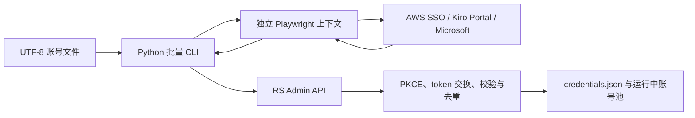

# RS 批量企业账号与 Microsoft 账号自动登录设计

## 1. 背景

`kiro.rs-admin` 已经具备单账号 AWS IAM Identity Center/Builder ID 设备授权登录，以及 Kiro Portal Social/External IdP 登录能力。`Kiro-Go` 中也有对应的 `iam_sso.go`、`m365_sso.go` 和 OIDC token 交换实现。

当前缺口不是 OAuth 协议本身，而是一个可重复执行的批量自动化客户端：从账号密码文本中逐条取号，在独立浏览器上下文中完成真实登录页面操作，将回调交给 RS，并可靠记录成功、失败和可恢复状态。

## 2. 目标

- 提供独立运行的 Python CLI，包含 `enterprise` 和 `microsoft` 两种批量登录模式。
- 默认解析 `账号----密码`，同时允许用户自定义安全、可预测的格式模板。
- 自动打开真实浏览器页面、填写账号密码、点击登录并捕获 OAuth 回调。
- MFA、验证码和组织条件访问出现时允许人工接管当前浏览器。
- 复用 RS 已有登录协议与凭证入库逻辑，密码不上传到 RS。
- 为自动化客户端补齐会话取消、稳定错误分类、重复账号处理和日志脱敏。
- 支持中断恢复、失败重试和机器可读的脱敏结果文件。

## 3. 非目标

- 不让 RS 服务端安装或运行 Chrome/Playwright。
- 不由 RS 管理页面远程启动 Python 脚本。
- 不通过未公开的 AWS/Microsoft 用户名密码接口绕过浏览器登录。
- 不尝试自动绕过 MFA、验证码、账号锁定或组织安全策略。
- 不将账号密码、Admin Key、OAuth code、access token 或 refresh token 写入日志和结果文件。
- 不推送 GitHub；开发和提交均在本地仓库完成。

## 4. 方案选择

### 4.1 采用：本地 Python/Playwright + RS 受保护接口

Python 负责账号解析、浏览器自动化、回调捕获、重试和 checkpoint；RS 负责 PKCE/OIDC 会话、token 交换、凭证校验、去重和账号池刷新。

优点：

- 浏览器和明文密码只存在于操作者机器。
- 继续使用真实登录页面，兼容 Cookie、MFA、验证码和条件访问。
- 不增加 RS 容器的浏览器依赖和显示服务。
- 能最大限度复用当前 RS 登录代码。

### 4.2 未采用：RS 服务端直接运行浏览器

该方案需要在服务器或容器中安装 Chromium、Playwright、字体和显示依赖，还需要解决远程接管 MFA、浏览器生命周期和大量敏感调试产物，部署和安全成本过高。

### 4.3 未采用：纯 HTTP 模拟用户名密码登录

AWS 和 Microsoft 登录链路包含页面 Cookie、PKCE、租户策略、MFA、验证码和频繁变化的内部接口。直接模拟不稳定，也会扩大密码处理范围。

## 5. 总体架构



组件职责：

- `scripts/kiro_batch_login.py`：CLI 入口、参数校验和运行汇总。
- Python 账号解析模块：格式模板编译、逐行解析、校验、去重和脱敏预览。
- Python RS 客户端：Admin API 鉴权、超时、重试、错误归一化和会话取消。
- Python 浏览器驱动：企业登录、Kiro Portal/Microsoft 两段登录、MFA 等待和回调捕获。
- Python checkpoint 模块：逐账号落盘、恢复和退出码计算。
- RS Admin 服务：复用 IDC/Social 登录会话，补充自动化客户端所需的兼容行为。

## 6. 输入格式与解析

### 6.1 默认格式

```text
account@example.com----password123
another@example.com----another-password
```

默认模板为：

```text
{account}----{password}
```

### 6.2 自定义模板

CLI 提供 `--format`，模板必须恰好包含一次 `{account}` 和一次 `{password}`。两个占位符之间的文本作为字面分隔符，不接受任意正则表达式。

支持示例：

```text
{account}|{password}
{account}####{password}
{password}----{account}
```

解析规则：

- 账号在前时只按首次出现的分隔符切分。
- 密码在前时只按最后一次出现的分隔符切分。
- 账号去除首尾空白；密码仅移除行尾换行符，不删除有效空格。
- 支持 UTF-8 和 UTF-8 BOM。
- 忽略空行和首个非空字符为 `#` 的注释行。
- 空账号、空密码、缺少分隔符或模板非法时，在启动浏览器前汇总行号和原因。
- Microsoft 模式要求账号符合基本邮箱形式；企业模式允许邮箱或普通用户名。
- 同一输入中的重复账号默认只执行第一次，其余条目标记为 `duplicate_input`。

示例：

```text
user@example.com----abc----123
```

解析结果为账号 `user@example.com`、密码 `abc----123`。

## 7. CLI 接口

企业账号示例：

```powershell
$env:KIRO_RS_ADMIN_KEY = '<admin-key>'
python scripts/kiro_batch_login.py enterprise `
  --input accounts.txt `
  --start-url https://example.awsapps.com/start `
  --region us-east-1 `
  --rs-url https://rs.example.com
```

Microsoft 示例：

```powershell
$env:KIRO_RS_ADMIN_KEY = '<admin-key>'
python scripts/kiro_batch_login.py microsoft `
  --input accounts.txt `
  --format "{account}----{password}" `
  --rs-url https://rs.example.com
```

公共参数：

- `--input`：账号文件；可选支持 `-` 从标准输入读取。
- `--format`：账号密码格式模板，默认 `{account}----{password}`。
- `--rs-url`：RS 对外可访问的根地址。
- `--admin-key-env`：Admin Key 环境变量名，默认 `KIRO_RS_ADMIN_KEY`。
- `--headed` / `--headless`：默认有界面运行，方便 MFA/验证码接管。
- `--timeout`：单账号最长等待时间。
- `--mfa-timeout`：检测到 MFA 后允许人工处理的等待时间。
- `--result`：脱敏 JSONL 结果文件。
- `--resume`：读取已有 checkpoint，仅继续未完成或允许重试的条目。

企业模式额外要求 `--start-url`，并允许设置 `--region`。Microsoft 模式默认 AWS 业务区域为 `us-east-1`，允许显式覆盖。

密码不得通过命令行参数提供，避免进入 shell 历史和进程列表。

## 8. 企业账号登录流程

1. Python 调用 `POST /api/admin/auth/idc/start`，提交 `startUrl`、`region` 和可选的账号提示。
2. RS 注册 OIDC 客户端并发起设备授权，返回 `sessionId`、`verificationUriComplete`、`userCode` 和 `pollInterval`。
3. Python 为该账号创建新的无痕 Playwright BrowserContext，打开验证链接。
4. 浏览器驱动使用可访问性角色、label、name 和有限的 URL 特征定位“用户名”“下一步”“密码”“登录”等控件，不依赖单一 CSS class。
5. 脚本自动填写账号密码并提交。
6. Python 按 RS 返回的间隔轮询 `POST /api/admin/auth/idc/poll/{sessionId}`。
7. 授权完成后，RS 交换 token、创建或识别已有凭证、刷新余额和账号池，并返回 `credentialId`。
8. Python 立即关闭该账号的 BrowserContext，写入 checkpoint，再处理下一项。

检测到 MFA、验证码或未知确认页面时，脚本保持窗口并提示人工完成。超时后取消 RS 会话并将该条目标记为需要人工处理。

## 9. Microsoft 登录流程

1. Python 调用 `POST /api/admin/auth/social/start` 获取 `sessionId` 和 Kiro Portal `portalUrl`。
2. Python 在新的无痕 BrowserContext 中打开 `portalUrl`，填写 Kiro Portal 和 Microsoft 登录页所需的账号密码。
3. 浏览器导航到第一段 `/signin/callback` 时，即使本地回调端口没有监听，Python 仍从导航请求或当前 URL 捕获完整回调地址。
4. Python 解析回调地址并调用 `POST /api/admin/auth/social/complete/{sessionId}`。
5. 对 External IdP，RS 返回 `status=continue` 和 `nextUrl`。Python 在同一 BrowserContext 中打开该 Microsoft Entra 授权地址，以保留租户登录 Cookie。
6. 浏览器导航到最终 `/oauth/callback` 时，Python再次捕获完整 URL并提交给同一 complete 接口。
7. RS 校验 state、交换 Entra token、解析账号信息、创建或识别已有凭证并返回 `credentialId`。
8. Python 关闭 BrowserContext 并写入 checkpoint。

远程部署不要求把 RS 的 loopback 回调端口暴露到公网，也不强制使用 SSH 回调隧道。只要 Python 能访问受保护的 RS Admin API 即可；无法直接访问时，可使用普通 SSH 本地端口转发访问 Admin API。

## 10. RS 接口调整

现有接口继续作为主要协议接口：

- `POST /api/admin/auth/idc/start`
- `POST /api/admin/auth/idc/poll/{sessionId}`
- `POST /api/admin/auth/social/start`
- `POST /api/admin/auth/social/poll/{sessionId}`
- `POST /api/admin/auth/social/complete/{sessionId}`

新增或补齐：

- `DELETE /api/admin/auth/idc/{sessionId}`：取消并清理 IDC 会话。
- `DELETE /api/admin/auth/social/{sessionId}`：取消、停止回调监听并清理 Social 会话。
- 在现有错误响应上增加可选的稳定字段：`code`、`stage` 和 `retryable`，不删除旧字段，保持管理端兼容。
- 成功响应继续返回 `credentialId`；识别为已有凭证时返回同一 ID，并增加 `duplicate: true`。
- 账号去重优先使用已解析的 `profileArn`/`userId` 等稳定身份；无法取得时使用认证方式、规范化邮箱以及 `issuerUrl` 或 `startUrl` 的组合，不以邮箱单字段跨租户去重。

所有接口继续经过现有 Admin API 中间件，支持 `x-api-key` 和 `Authorization: Bearer`。不增加未认证的“上号接口”。

## 11. 错误分类与重试

稳定错误码至少包括：

- `invalid_credentials`
- `mfa_timeout`
- `captcha_required`
- `account_locked`
- `session_expired`
- `duplicate_input`
- `duplicate_credential`
- `callback_invalid`
- `state_mismatch`
- `network_error`
- `upstream_error`
- `rs_auth_failed`
- `rs_internal_error`
- `cancelled`
- `unknown_page`

重试策略：

- 网络错误、连接超时和 RS/AWS/Microsoft 5xx 最多自动重试两次，使用短指数退避。
- 密码错误、账号锁定、state 不匹配和格式错误不自动重试。
- MFA/验证码允许一次人工接管等待，不尝试绕过。
- 失败时优先调用会话取消接口；取消失败也必须关闭本地 BrowserContext，并在结果中记录清理失败。

## 12. 串行执行与浏览器隔离

第一版默认并限定为串行执行。每个账号创建新的 BrowserContext，不复用 Cookie、LocalStorage、SessionStorage 或缓存。

串行设计避免：

- 多个 AWS/Microsoft 登录页互相串号。
- 多个 MFA 窗口难以确认归属。
- 同一租户触发额外风控或锁定。
- 回调与 RS session 对应错误。

未来如需并发，应先验证 RS 会话并发、浏览器资源、租户风控和人工接管体验，再单独设计受限 worker 数量。

## 13. Checkpoint 与结果文件

每完成一个账号立即追加一条 JSONL 记录并刷新到磁盘。记录包含：

- `runId`
- 原始行号
- 账号 SHA-256 摘要和脱敏显示值
- 登录模式
- 当前阶段
- 最终状态
- `credentialId`
- 稳定错误码和脱敏错误信息
- 尝试次数与时间戳

结果文件不包含账号密码、Admin Key、OAuth code 或 token。恢复时重新读取原始输入，使用账号摘要和行号匹配 checkpoint。

退出码：

- `0`：全部成功或已存在。
- `2`：运行完成但存在失败、超时或需要人工处理的账号。
- `1`：配置、输入、Admin 鉴权或 RS 连接级错误导致批次无法执行。

收到 `Ctrl+C` 时，脚本取消当前 RS 会话、关闭 BrowserContext 和 Browser，写入 `cancelled` checkpoint 后退出。

## 14. 安全与隐私

- Admin Key 仅从指定环境变量读取。
- 默认校验 HTTPS 证书，不默认提供关闭证书校验的快捷参数。
- 登录密码只保存在当前 Python 进程内存和 Playwright 填写操作中。
- 日志统一脱敏账号、URL query、authorization code、token 和代理认证信息。
- 默认不保存 Playwright trace、HAR、页面 HTML、控制台转储或截图。
- 可选失败截图必须显式开启，并在文档中警告截图可能包含账号、租户或 MFA 信息。
- 初始实现不依赖浏览器抓包；只有真实联调出现仓库协议未覆盖的分支时，才针对失败步骤采集脱敏 HAR。

## 15. 管理端范围

Python 脚本独立运行，因此 RS React 管理端不新增“启动本地 Python”按钮，也不要求管理端上传明文账号密码。

登录成功后，现有账号列表、余额刷新、分组、代理和批量管理功能自动展示新凭证。若需要帮助入口，只在现有添加账号区域提供不含敏感数据的运行说明或文档链接；这不是第一版必需功能。

## 16. 测试策略

### 16.1 Python 单元测试

- 默认与自定义模板解析。
- 密码包含分隔符。
- 密码在前的模板使用末次切分。
- UTF-8 BOM、空行、注释、空账号、空密码和重复账号。
- 日志与错误信息脱敏。
- checkpoint 追加、恢复和退出码计算。
- RS 客户端对稳定错误码和 retryable 的映射。

### 16.2 Playwright 合约测试

使用本地模拟页面，不访问真实账号：

- 企业用户名页、密码页和成功页。
- Kiro Portal 第一段 descriptor 回调。
- Microsoft 第二段授权和最终回调。
- MFA 页面暂停与超时。
- 未知页面、账号锁定和错误密码页面。
- 回调端口无法连接时仍能捕获导航 URL。

### 16.3 Rust 测试

- IDC/Social 取消路由需要 Admin Key。
- 取消存在、缺失和已过期会话。
- 错误响应保持旧字段并增加稳定字段。
- 重复凭证返回已有 `credentialId`，不新增条目。
- token、code 和账号信息不会出现在服务日志格式化结果中。

### 16.4 最终联调

在自动测试全部通过后，分别使用一个企业测试账号和一个 Microsoft 测试账号进行有界面人工联调。联调重点验证真实页面选择器、MFA 接管、回调捕获、RS 入库、重复执行和中断恢复。

## 17. 验收标准

- 两种模式均能从账号文件自动逐条登录并将成功账号加入 RS。
- 自定义格式模板解析正确，所有格式错误在浏览器启动前给出行号。
- 密码不进入 RS、日志、checkpoint 或结果文件。
- Microsoft 两段回调无需公开 RS loopback 端口即可完成。
- MFA/验证码可人工接管，超时后批次继续执行。
- 中断后可恢复，成功账号不会重复写入。
- RS 新接口继续受 Admin API Key 保护。
- Python、Playwright 合约测试、Rust 测试和前端现有测试均通过。
